# Eido

**Eido — describe what you see**

Eido is a declarative, data-driven image language for Clojure.
Describe what you see as plain data — not drawing instructions.

<p align="center">
  
  
  
</p>
<p align="center">
  
  
  
</p>

## Design

This project has been on my mind since I discovered Clojure in 2020. As a graphics nerd, describing images as plain data — not issuing drawing commands — felt like the natural thing to build.

The approach is inspired by Christian Johansen's [Replicant](https://github.com/cjohansen/replicant), which showed how far a minimal, data-first approach to rendering can go. Eido applies that thinking to image generation — 2D shapes, 3D scenes, and animations alike.

- **Images are values.** A scene is a plain Clojure map — printable, serializable, diffable. Nothing opaque.
- **One function.** `render` takes a scene (or a sequence of scenes) and produces output. That's the API.
- **Description, not instruction.** You declare what the image contains; eido decides how to draw it. A compile step separates your description from the renderer's execution.
- **Animations are sequences.** 60 frames = 60 maps in a vector. No timeline, no keyframes, no mutation.
- **Particle simulation.** Physics-based effects (fire, snow, sparks) configured as data — emitters, forces, and lifetime curves. Deterministic via seeded PRNG.
- **Typography as paths.** Text is declared as data and compiled to vector paths — compatible with every feature: gradients, transforms, filters, 3D extrusion. Per-glyph styling, text on curves, and extruded 3D letterforms — all without additional dependencies.
- **No state, no framework.** Every function takes data and returns data. You bring your own workflow.
- **Zero dependencies.** Just Clojure and the standard library.

If it cannot be represented as plain data, it probably should not be in the library.

## Installation

Add eido as a git dependency in your `deps.edn`:

```clojure
io.github.leifericf/eido {:git/tag "v1.0.0-alpha4" :git/sha "1e8d203"}
```

## Quick Start

Requires Clojure 1.12+ and Java 11+.

Clone the repo to try the examples:

```sh
git clone git@github.com:leifericf/eido.git
cd eido
```

Start a REPL:

```sh
clj -M:dev
```

Render your first image:

```clojure
(require '[eido.core :as eido])

(eido/render
  {:image/size [400 400]
   :image/background [:color/rgb 245 243 238]
   :image/nodes
   [{:node/type :shape/circle
     :circle/center [200 200]
     :circle/radius 120
     :style/fill [:color/rgb 200 50 50]}]}
  {:output "circle.png"})
```


Or preview interactively in a window:

```clojure
(show {:image/size [400 400]
       :image/background [:color/rgb 245 243 238]
       :image/nodes
       [{:node/type :shape/circle
         :circle/center [200 200]
         :circle/radius 120
         :style/fill [:color/rgb 200 50 50]}]})
```

## Shapes

Primitives: rectangles, circles, ellipses, arcs, lines, and paths.

```clojure
;; Rectangle
{:node/type :shape/rect
 :rect/xy [50 50]
 :rect/size [200 100]
 :style/fill [:color/rgb 0 128 255]}

;; Rounded rectangle
{:node/type :shape/rect
 :rect/xy [50 50]
 :rect/size [200 100]
 :rect/corner-radius 16
 :style/fill [:color/rgb 0 128 255]}

;; Circle
{:node/type :shape/circle
 :circle/center [200 200]
 :circle/radius 80
 :style/stroke {:color [:color/rgb 0 0 0] :width 2}}

;; Ellipse
{:node/type :shape/ellipse
 :ellipse/center [200 200]
 :ellipse/rx 120
 :ellipse/ry 60
 :style/fill [:color/rgb 200 50 50]}

;; Arc (partial ellipse)
{:node/type :shape/arc
 :arc/center [200 200]
 :arc/rx 80 :arc/ry 80
 :arc/start 0 :arc/extent 270
 :arc/mode :pie                 ;; :open, :chord, or :pie
 :style/fill [:color/rgb 255 200 50]}

;; Line
{:node/type :shape/line
 :line/from [50 50]
 :line/to [350 250]
 :style/stroke {:color [:color/rgb 0 0 0] :width 2}}

;; Path (arbitrary shapes via move/line/curve/close)
{:node/type :shape/path
 :path/commands [[:move-to [100 200]]
                 [:line-to [200 50]]
                 [:curve-to [250 0] [300 100] [300 200]]  ;; cubic bezier
                 [:quad-to [250 250] [200 200]]            ;; quadratic bezier
                 [:close]]
 :style/fill [:color/rgb 255 200 50]}
```


## Text

Text is declared as data and compiled to vector path outlines. Three node types cover different use cases:

```clojure
;; Simple text — entire string as one path
{:node/type   :shape/text
 :text/content "Hello"
 :text/font   {:font/family "Serif" :font/size 48 :font/weight :bold}
 :text/origin [50 100]       ;; baseline-left anchor
 :text/align  :center        ;; :left (default), :center, :right
 :style/fill  [:color/rgb 0 0 0]}

;; Per-glyph control — style each character independently
{:node/type    :shape/text-glyphs
 :text/content "COLOR"
 :text/font    {:font/family "SansSerif" :font/size 64}
 :text/origin  [50 100]
 :text/glyphs  [{:glyph/index 0 :style/fill [:color/rgb 255 0 0]}
                 {:glyph/index 1 :style/fill [:color/rgb 0 255 0]}]
 :style/fill   [:color/rgb 100 100 100]}  ;; default for unlisted glyphs

;; Text on path — glyphs follow a curve
{:node/type    :shape/text-on-path
 :text/content "ALONG A CURVE"
 :text/font    {:font/family "SansSerif" :font/size 24}
 :text/path    [[:move-to [50 200]]
                [:curve-to [150 50] [350 50] [450 200]]]
 :text/offset  10             ;; start distance along path
 :text/spacing 1              ;; extra inter-glyph spacing
 :style/fill   [:color/rgb 0 0 0]}
```

Text works with everything: gradient fills, strokes, transforms, filters, clipping, compositing, and 3D extrusion. Since text compiles to paths, the examples in the [Typography Gallery](#typography-gallery) show what's possible.

Fonts reference system fonts by name (`:font/family`) or custom TTF/OTF files (`:font/file`). Java logical fonts — `"Serif"`, `"SansSerif"`, `"Monospaced"` — are available on every JDK.

## Composition

Groups compose shapes with shared style, opacity, and transforms.
Styles inherit from parent to child. Opacity multiplies through the tree.

```clojure
{:image/size [400 400]
 :image/background [:color/rgb 255 255 255]
 :image/nodes
 [{:node/type :group
   :node/transform [[:transform/translate 200 200]]
   :style/fill [:color/rgb 255 0 0]
   :node/opacity 0.8
   :group/children
   [{:node/type :shape/circle
     :circle/center [0 0]
     :circle/radius 80}
    {:node/type :shape/rect
     :rect/xy [-30 -30]
     :rect/size [60 60]
     :style/fill [:color/rgb 0 0 255]
     :node/opacity 0.5}]}]}
```


## Stroke Styling

Strokes support line cap, line join, and dash patterns:

```clojure
;; Rounded line caps and bevel joins
{:style/stroke {:color [:color/rgb 0 0 0] :width 4
                :cap :round          ;; :butt, :round, or :square
                :join :bevel}}       ;; :miter, :round, or :bevel

;; Dashed stroke
{:style/stroke {:color [:color/rgb 0 0 0] :width 2
                :dash [10 5]}}       ;; [dash-length gap-length ...]
```


## Clipping

Groups can be clipped to a shape, restricting children to a region:

```clojure
{:node/type :group
 :group/clip {:node/type :shape/circle
              :circle/center [200 200]
              :circle/radius 80}
 :group/children
 [{:node/type :shape/rect
   :rect/xy [120 120]
   :rect/size [160 160]
   :style/fill [:color/rgb 255 0 0]}]}
;; Only the parts of the rectangle inside the circle are visible.
```

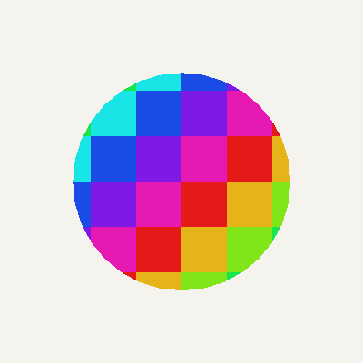

## Path Contours

Paths support a fill rule for creating holes. Use `:path/fill-rule :even-odd` with multiple closed sub-paths:

```clojure
;; Donut: outer circle with inner hole
{:node/type :shape/path
 :path/fill-rule :even-odd
 :path/commands [;; Outer circle (approximated with curves)
                 [:move-to [200 120]]
                 [:curve-to [244 120] [280 156] [280 200]]
                 [:curve-to [280 244] [244 280] [200 280]]
                 [:curve-to [156 280] [120 244] [120 200]]
                 [:curve-to [120 156] [156 120] [200 120]]
                 [:close]
                 ;; Inner hole
                 [:move-to [200 160]]
                 [:curve-to [222 160] [240 178] [240 200]]
                 [:curve-to [240 222] [222 240] [200 240]]
                 [:curve-to [178 240] [160 222] [160 200]]
                 [:curve-to [160 178] [178 160] [200 160]]
                 [:close]]
 :style/fill [:color/rgb 200 50 50]}
```


## Colors

Multiple color formats are supported:

```clojure
[:color/rgb 255 0 0]            ;; RGB (0-255)
[:color/rgba 255 0 0 0.5]       ;; RGB with alpha (0-1)
[:color/hsl 0 1.0 0.5]          ;; HSL: hue (0-360), saturation (0-1), lightness (0-1)
[:color/hsla 120 0.8 0.5 0.7]   ;; HSL with alpha
[:color/hsb 0 1.0 1.0]          ;; HSB/HSV: hue (0-360), saturation (0-1), brightness (0-1)
[:color/hsba 120 0.8 0.5 0.7]   ;; HSB with alpha
[:color/hex "#FF0000"]           ;; Hex (6-digit, 8-digit, 3-digit, 4-digit)
[:color/name "coral"]            ;; CSS named color (148 standard colors)
```

All color formats work directly in style maps — no manual resolution needed:

```clojure
{:style/fill [:color/hsl 200 0.9 0.5]}   ;; HSL straight in the scene
{:style/fill [:color/hex "#FF6B35"]}      ;; hex too
{:style/fill [:color/name "tomato"]}      ;; named colors too
```

Color manipulation helpers accept and return color vectors:

```clojure
(require '[eido.color :as color])

(color/lighten [:color/rgb 255 0 0] 0.2)          ;; lighter red
(color/darken [:color/rgb 255 0 0] 0.2)           ;; darker red
(color/saturate [:color/rgb 150 100 100] 0.3)     ;; more vivid
(color/desaturate [:color/rgb 255 0 0] 0.5)       ;; more muted
(color/rotate-hue [:color/rgb 255 0 0] 120)       ;; green
(color/lerp [:color/rgb 0 0 0] [:color/rgb 255 255 255] 0.5) ;; blend
```

## Gradient Fills

Fills can be solid colors or gradients. Both linear and radial gradients are supported:

```clojure
;; Linear gradient — left to right, red to blue
{:style/fill {:gradient/type :linear
              :gradient/from [0 0]
              :gradient/to [200 0]
              :gradient/stops [[0.0 [:color/rgb 255 0 0]]
                               [1.0 [:color/rgb 0 0 255]]]}}

;; Radial gradient — white center fading to black
{:style/fill {:gradient/type :radial
              :gradient/center [100 100]
              :gradient/radius 100
              :gradient/stops [[0.0 [:color/name "white"]]
                               [1.0 [:color/name "black"]]]}}

;; Multi-stop gradient
{:style/fill {:gradient/type :linear
              :gradient/from [0 0]
              :gradient/to [400 0]
              :gradient/stops [[0.0 [:color/name "red"]]
                               [0.5 [:color/name "yellow"]]
                               [1.0 [:color/name "blue"]]]}}
```

Gradient coordinates use `userSpaceOnUse` — they are relative to the scene, not the shape. Any color format works in stops (RGB, HSL, hex, named colors).

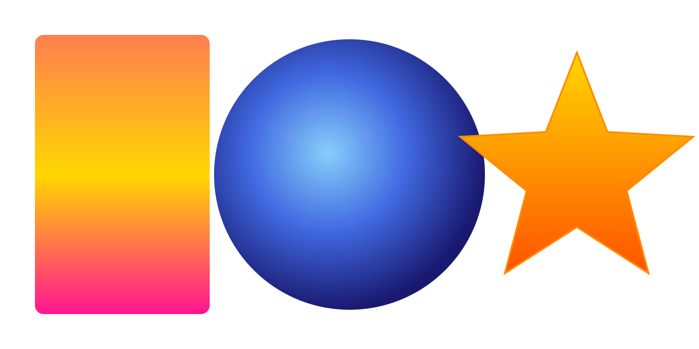

## Generative Patterns

The `eido.scene` namespace provides helpers for common patterns:

```clojure
(require '[eido.scene :as scene])

;; Grid of circles
(scene/grid 10 10
  (fn [col row]
    {:node/type :shape/circle
     :circle/center [(+ 30 (* col 40)) (+ 30 (* row 40))]
     :circle/radius 15
     :style/fill [:color/rgb (* col 25) (* row 25) 128]}))
```


```clojure
;; Points along a line
(scene/distribute 8 [50 200] [750 200]
  (fn [x y t]
    {:node/type :shape/circle
     :circle/center [x y]
     :circle/radius (+ 5 (* 20 t))
     :style/fill [:color/rgb 0 0 0]}))
```


```clojure
;; Arranged around a circle
(scene/radial 12 200 200 120
  (fn [x y _angle]
    {:node/type :shape/circle
     :circle/center [x y]
     :circle/radius 15
     :style/fill [:color/rgb 200 0 0]}))
```


```clojure
;; Polygon from points
(scene/polygon [[100 200] [200 50] [300 200]])
;; => {:node/type :shape/path, :path/commands [[:move-to ...] ...]}

;; Convenience triangle
(scene/triangle [100 200] [200 50] [300 200])

;; Smooth curve through points (Catmull-Rom → cubic bezier)
(scene/smooth-path [[50 200] [150 50] [250 200] [350 50]])

;; Regular polygon (n-sided, centered)
(scene/regular-polygon [200 200] 80 6)   ;; hexagon

;; Star (n-pointed, with outer and inner radii)
(scene/star [200 200] 80 35 5)           ;; 5-pointed star
```

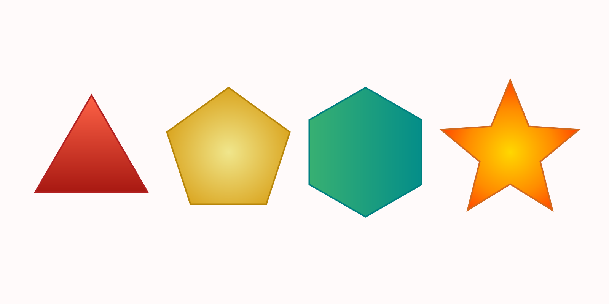

## Transforms

All nodes support translate, rotate, scale, and shear transforms:

```clojure
{:node/transform [[:transform/translate 100 50]
                  [:transform/rotate 0.785]       ;; radians
                  [:transform/scale 1.5 1.5]
                  [:transform/shear-x 0.3]        ;; skew along x
                  [:transform/shear-y 0.2]]}      ;; skew along y
```

## File Workflow

Scenes can be stored as `.edn` files and rendered directly:

```clojure
;; Read a scene file and render
(eido/render (eido/read-scene "my-scene.edn") {:output "out.png"})

;; Watch a file and auto-reload the preview on save
(watch-file "my-scene.edn")

;; Watch an atom for live coding
(def my-scene (atom {...}))
(watch-scene my-scene)
(swap! my-scene assoc-in [:image/nodes 0 :circle/radius] 150)

;; Stop watching
(unwatch)
```

## tap> Integration

Render any scene by tapping it:

```clojure
(install-tap!)
(tap> {:image/size [200 200]
       :image/background [:color/rgb 0 0 0]
       :image/nodes [{:node/type :shape/circle
                      :circle/center [100 100]
                      :circle/radius 60
                      :style/fill [:color/rgb 255 200 50]}]})
```

## Export

All output goes through `render`:

```clojure
;; PNG (default)
(eido/render scene {:output "out.png"})

;; JPEG with quality
(eido/render scene {:output "out.jpg" :quality 0.9})

;; SVG (scalable vector output)
(eido/render scene {:output "out.svg"})

;; SVG string (no file)
(eido/render scene {:format :svg})

;; High-resolution (2x for retina)
(eido/render scene {:output "out.png" :scale 2})

;; PNG with DPI metadata
(eido/render scene {:output "out.png" :dpi 300})

;; Transparent background (no background fill)
(eido/render scene {:output "out.png" :transparent-background true})

;; BufferedImage (no output path)
(eido/render scene)
(eido/render scene {:scale 2})
```

Supported formats: PNG, JPEG, GIF, BMP, SVG.

## Validation

Scenes are validated automatically before rendering. Invalid scenes produce clear errors with paths:

```clojure
;; Check without rendering — returns nil if valid, or error vector
(eido/validate {:image/size [800 600]
                :image/background [:color/rgb 255 255 255]
                :image/nodes [{:node/type :shape/rect}]})
;; => [{:path [:image/nodes 0],
;;      :pred "missing required key :rect/xy", ...}]

;; Rendering an invalid scene throws ex-info with :errors in ex-data
(try
  (eido/render {:bad "scene"})
  (catch Exception e
    (ex-data e)))  ;; => {:errors [...]}
```

## Animation

Animations are sequences of scenes. Build the frames however you like, then render.

```clojure
(require '[eido.animate :as anim])

;; Build 60 frames — each is a plain scene map
(def frames
  (anim/frames 60
    (fn [t]
      (let [r (anim/lerp 20 80 (anim/ease-in-out (anim/ping-pong t)))]
        {:image/size [200 200]
         :image/background [:color/rgb 30 30 40]
         :image/nodes
         (scene/radial 6 100 100 r
           (fn [x y _]
             {:node/type :shape/circle
              :circle/center [x y]
              :circle/radius 12
              :style/fill [:color/rgb 255 100 50]}))}))))

```


```clojure
;; Export as animated GIF (30 fps)
(eido/render frames {:output "animation.gif" :fps 30})

;; GIF without looping
(eido/render frames {:output "once.gif" :fps 30 :loop false})

;; Export as animated SVG (SMIL)
(eido/render frames {:output "animation.svg" :fps 30})

;; Animated SVG string (no file)
(eido/render frames {:format :svg :fps 30})

;; Export as numbered PNG sequence
(eido/render frames {:output "frames/" :fps 30})

;; Custom file prefix
(eido/render frames {:output "frames/" :fps 30 :prefix "img-"})

;; Preview in REPL window (dev only)
(play frames 30)
(stop)
```

### Animation Helpers

The `eido.animate` namespace provides pure functions for building frame sequences:

```clojure
(anim/frames 60 (fn [t] ...))  ;; build n frames, t is progress [0, 1]
(anim/progress 15 60)          ;; => 0.25 (normalized frame position)
(anim/ping-pong 0.75)          ;; => 0.5  (oscillate 0->1->0)
(anim/cycle-n 3 0.5)           ;; => 0.5  (3 full cycles)
(anim/lerp 0 100 0.5)          ;; => 50.0 (numeric interpolation)
(anim/ease-in 0.5)             ;; => 0.25 (quadratic ease in)
(anim/ease-out 0.5)            ;; => 0.75 (quadratic ease out)
(anim/ease-in-out 0.5)         ;; => 0.5  (quadratic ease in-out)
(anim/stagger 2 5 0.5 0.3)    ;; per-element progress for staggered animations

;; Extended easing curves (all have ease-in-*, ease-out-*, ease-in-out-* variants)
(anim/ease-in-cubic 0.5)      ;; cubic
(anim/ease-out-quart 0.5)     ;; quartic
(anim/ease-in-expo 0.5)       ;; exponential
(anim/ease-out-circ 0.5)      ;; circular
(anim/ease-in-back 0.5)       ;; overshoot
(anim/ease-out-elastic 0.5)   ;; spring-like
(anim/ease-out-bounce 0.5)    ;; bouncing
```

Eight easing curves compared — each dot follows a different curve:

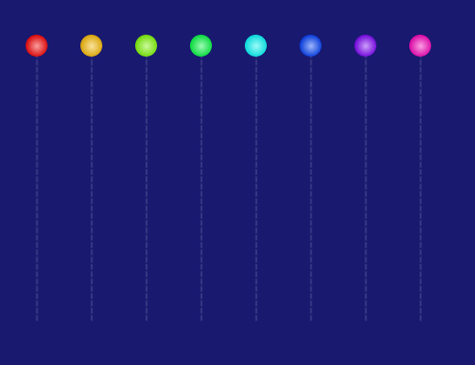

### Particle Simulation

For physics-based animations, `eido.particle/simulate` runs a deterministic particle simulation and returns a lazy sequence of node vectors — one per frame:

```clojure
(require '[eido.particle :as particle])

;; Pre-compute 60 frames of fire particles
(let [frames (vec (particle/simulate
                    (particle/with-position particle/fire [200 350])
                    60 {:fps 30}))]
  ;; Compose with other scene elements using standard Clojure
  (eido/render
    (anim/frames 60
      (fn [t]
        {:image/size [400 400]
         :image/background [:color/rgb 20 15 10]
         :image/nodes (nth frames (int (* t 59)))}))
    {:output "fire.gif" :fps 30}))
```

Particle configs are plain maps — customize presets with `assoc`/`update`:

```clojure
(-> particle/fire
    (particle/with-position [200 350])
    (assoc :particle/seed 99)
    (update :particle/forces conj {:force/type :wind
                                    :force/direction [1 0]
                                    :force/strength 20}))
```

See the [Particle Gallery](#particle-gallery) for full examples including 3D particles.

## 2D Gallery

These examples combine grids, color manipulation, and animation helpers to create patterns that would be difficult to produce without code.

### Spiral Rainbow

A rotating spiral wave where hue follows the angle and pulse follows the distance from center.

```clojure
(def frames
  (anim/frames 60
    (fn [t]
      {:image/size [400 400]
       :image/background [:color/rgb 10 10 18]
       :image/nodes
       (scene/grid 20 20
         (fn [col row]
           (let [cx (- (/ col 9.5) 1.0)
                 cy (- (/ row 9.5) 1.0)
                 dist (Math/sqrt (+ (* cx cx) (* cy cy)))
                 angle (Math/atan2 cy cx)
                 spiral (mod (+ (* dist 2.0)
                                (* angle (/ 1.0 Math/PI))
                                (- (* t 3.0))) 1.0)
                 pulse (/ (+ 1.0 (Math/sin (* spiral 2.0 Math/PI))) 2.0)
                 radius (+ 2 (* 8 pulse))
                 hue (mod (+ (* angle (/ 180.0 Math/PI)) 180 (* t 360)) 360)]
             {:node/type :shape/circle
              :circle/center [(+ 12 (* col 19.8)) (+ 12 (* row 19.8))]
              :circle/radius radius
              :style/fill [:color/hsl hue 0.9 (+ 0.3 (* 0.35 pulse))]})))})))

(eido/render frames {:output "spiral.gif" :fps 24})
```


### Sine Interference

Three overlapping sine waves at different frequencies create organic, shifting patterns.

```clojure
(def frames
  (anim/frames 50
    (fn [t]
      {:image/size [400 400]
       :image/background [:color/rgb 10 10 18]
       :image/nodes
       (scene/grid 20 20
         (fn [col row]
           (let [x (/ col 19.0)
                 y (/ row 19.0)
                 v (/ (+ (Math/sin (+ (* x 8) (* t 2 Math/PI)))
                         (Math/sin (+ (* y 6) (* t 2 Math/PI 1.3)))
                         (Math/sin (+ (* (+ x y) 5) (* t 2 Math/PI 0.7)))) 3.0)
                 pulse (/ (+ v 1.0) 2.0)
                 radius (+ 3 (* 7 pulse))
                 hue (mod (+ (* pulse 200) (* t 360) 180) 360)]
             {:node/type :shape/circle
              :circle/center [(+ 12 (* col 19.8)) (+ 12 (* row 19.8))]
              :circle/radius radius
              :style/fill [:color/hsl hue 0.9 (+ 0.35 (* 0.3 pulse))]})))})))

(eido/render frames {:output "sine-field.gif" :fps 24})
```


### Breathing Wave

A diagonal wave where cells expand and contract with staggered timing, hue shifting along the diagonal.

```clojure
(def frames
  (anim/frames 50
    (fn [t]
      {:image/size [400 400]
       :image/background [:color/rgb 245 243 238]
       :image/nodes
       (scene/grid 14 14
         (fn [col row]
           (let [delay (/ (+ col row) 26.0)
                 phase (mod (- (* t 2.0) delay) 1.0)
                 breath (/ (+ 1.0 (Math/sin (* phase 2.0 Math/PI))) 2.0)
                 size (+ 3 (* 10 breath))
                 hue (mod (+ (* (+ col row) 14) (* t 120)) 360)]
             {:node/type :shape/circle
              :circle/center [(+ 18 (* col 27)) (+ 18 (* row 27))]
              :circle/radius size
              :style/fill [:color/hsl hue (+ 0.5 (* 0.4 breath)) 0.48]})))})))

(eido/render frames {:output "breathing.gif" :fps 24})
```


### Dancing Bars

Vertical bars with height, position, and color driven by overlapping sine waves.

```clojure
(def frames
  (anim/frames 50
    (fn [t]
      {:image/size [400 400]
       :image/background [:color/rgb 10 10 18]
       :image/nodes
       (vec (for [col (range 30)]
              (let [x-norm (/ col 29.0)
                    wave1 (Math/sin (+ (* x-norm 4 Math/PI) (* t 2 Math/PI)))
                    wave2 (Math/sin (+ (* x-norm 6 Math/PI) (* t 2 Math/PI 1.7)))
                    combined (/ (+ wave1 wave2) 2.0)
                    height (+ 40 (* 140 (/ (+ combined 1.0) 2.0)))
                    y-center (+ 200 (* 60 (Math/sin (+ (* x-norm 3 Math/PI)
                                                        (* t 2 Math/PI 0.5)))))
                    width (+ 4 (* 6 (/ (+ combined 1.0) 2.0)))
                    hue (mod (+ (* x-norm 360) (* t 200)) 360)]
                {:node/type :shape/rect
                 :rect/xy [(- (* (+ 0.5 col) (/ 400.0 30)) (/ width 2))
                            (- y-center (/ height 2))]
                 :rect/size [width height]
                 :style/fill [:color/hsl hue 0.85
                               (+ 0.35 (* 0.3 (/ (+ combined 1.0) 2.0)))]})))})))

(eido/render frames {:output "dancing-bars.gif" :fps 24})
```


### Tentacles

Eight arms spiral outward from the center, wobbling and shifting color along their length.

```clojure
(def frames
  (anim/frames 60
    (fn [t]
      {:image/size [400 400]
       :image/background [:color/rgb 10 10 18]
       :image/nodes
       (vec (for [arm (range 8)]
              (let [base-angle (+ (* arm (/ (* 2 Math/PI) 8)) (* t Math/PI 0.3))
                    hue (* arm 45)]
                {:node/type :group
                 :group/children
                 (vec (for [seg (range 25)]
                        (let [seg-t (/ seg 24.0)
                              r (* seg-t 180)
                              wobble (* 30 seg-t
                                       (Math/sin (+ (* seg-t 8) (* t 2 Math/PI)
                                                    (* arm 0.7))))
                              angle (+ base-angle
                                       (* seg-t 0.8
                                          (Math/sin (+ (* t 2 Math/PI) arm))))
                              x (+ 200 (* (+ r wobble) (Math/cos angle)))
                              y (+ 200 (* (+ r wobble) (Math/sin angle)))
                              size (max 1 (- 10 (* seg-t 8)))
                              seg-hue (mod (+ hue (* seg-t 90) (* t 120)) 360)]
                          {:node/type :shape/circle
                           :circle/center [x y]
                           :circle/radius size
                           :node/opacity (- 1.0 (* seg-t 0.6))
                           :style/fill [:color/hsl seg-hue 0.85 0.55]})))})))})))

(eido/render frames {:output "tentacles.gif" :fps 24})
```


### Pendulum Wave

15 pendulums with increasing frequencies create wave patterns. Uses paths for strings and circles for bobs.

```clojure
(def frames
  (anim/frames 80
    (fn [t]
      {:image/size [500 400]
       :image/background [:color/rgb 245 243 238]
       :image/nodes
       (vec (for [p (range 15)]
              (let [freq (+ 6 p)
                    angle (* (Math/sin (* t 2 Math/PI freq)) 0.9)
                    pivot-x (+ 30 (* p 31.4))
                    bob-x (+ pivot-x (* 250 (Math/sin angle)))
                    bob-y (* 250 (Math/cos angle))
                    hue (* p 24)]
                {:node/type :group
                 :group/children
                 [{:node/type :shape/path
                   :path/commands [[:move-to [pivot-x 20]]
                                   [:line-to [bob-x (+ 20 bob-y)]]]
                   :style/stroke {:color [:color/rgb 80 80 80] :width 1}}
                  {:node/type :shape/circle
                   :circle/center [bob-x (+ 20 bob-y)]
                   :circle/radius 10
                   :style/fill [:color/hsl hue 0.75 0.5]}]})))})))

(eido/render frames {:output "pendulum-wave.gif" :fps 30})
```


### Particle Galaxy

300 particles orbiting with Keplerian speeds and 3 spiral arms.

```clojure
(def frames
  (anim/frames 60
    (fn [t]
      {:image/size [500 500]
       :image/background [:color/rgb 5 5 12]
       :image/nodes
       (vec (for [p (range 300)]
              (let [arm (mod p 3)
                    base-r (+ 15 (* (Math/sqrt (/ p 300.0)) 220))
                    speed (/ 1.0 (Math/sqrt (max 1 base-r)))
                    angle (+ (* t 2 Math/PI speed 3)
                             (/ (* p 137.508) 50.0)
                             (* arm (/ (* 2 Math/PI) 3))
                             (* (/ base-r 300.0) 1.5))
                    r (+ base-r (* 8 (Math/sin (+ (* t 6 Math/PI) (* p 137.508)))))
                    x (+ 250 (* r (Math/cos angle)))
                    y (+ 250 (* r (Math/sin angle)))
                    hue (mod (+ 200 (* -200 (/ base-r 230.0))) 360)
                    bright (- 1.0 (* 0.5 (/ base-r 230.0)))
                    size (max 1 (- 4 (* 2.5 (/ base-r 230.0))))]
                {:node/type :shape/circle
                 :circle/center [x y]
                 :circle/radius size
                 :node/opacity (min 1.0 bright)
                 :style/fill [:color/hsl hue 0.8 (* 0.55 bright)]})))})))

(eido/render frames {:output "galaxy.gif" :fps 24})
```


### Op Art

Concentric rings that wobble to create an optical illusion, using only black and white.

```clojure
(def frames
  (anim/frames 50
    (fn [t]
      {:image/size [400 400]
       :image/background [:color/rgb 255 255 255]
       :image/nodes
       (vec (for [ring (reverse (range 40))]
              (let [phase (+ (* t 2 Math/PI) (* ring 0.3))
                    wobble (* 15 (Math/sin phase))
                    r (+ (* ring 7) wobble)]
                {:node/type :shape/circle
                 :circle/center [(+ 200 (* 5 (Math/sin (+ phase 1.5))))
                                 (+ 200 (* 5 (Math/cos phase)))]
                 :circle/radius (max 1 r)
                 :style/fill (if (even? ring)
                               [:color/rgb 0 0 0]
                               [:color/rgb 255 255 255])})))})))

(eido/render frames {:output "op-art.gif" :fps 24})
```


### Lissajous Curve

A 3:2 Lissajous figure traced with a rainbow trail that fades with age.

```clojure
(def frames
  (anim/frames 60
    (fn [t]
      {:image/size [400 400]
       :image/background [:color/rgb 5 5 12]
       :image/nodes
       (vec (for [j (range 200)]
              (let [s (/ j 200.0)
                    phase (* (+ t s) 2 Math/PI)
                    x (+ 200 (* 160 (Math/sin (* phase 3))))
                    y (+ 200 (* 160 (Math/cos (* phase 2))))
                    age (- 1.0 s)
                    hue (mod (* (+ t s) 720) 360)]
                {:node/type :shape/circle
                 :circle/center [x y]
                 :circle/radius (+ 1 (* 5 age age))
                 :node/opacity (* age age)
                 :style/fill [:color/hsl hue 0.9 (+ 0.3 (* 0.4 age))]})))})))

(eido/render frames {:output "lissajous.gif" :fps 30})
```


### Cellular Automaton

Evolving cellular patterns driven by sine wave interference, rendered as glowing colored cells.

```clojure
(def frames
  (anim/frames 40
    (fn [t]
      {:image/size [400 400]
       :image/background [:color/rgb 10 10 18]
       :image/nodes
       (scene/grid 25 25
         (fn [col row]
           (let [sum (+ (Math/sin (+ (* col 0.7) (* t 5)))
                        (Math/cos (+ (* row 0.8) (* t 4)))
                        (Math/sin (+ (* (+ col row) 0.4) (* t 3)))
                        (Math/cos (+ (* (Math/abs (- col row)) 0.6) (* t 6))))]
             (when (> sum 0.5)
               (let [glow (max 0 (/ (- sum 0.5) 3.5))
                     hue (mod (+ (* col 8) (* row 8) (* t 200)) 360)]
                 {:node/type :shape/rect
                  :rect/xy [(+ 2 (* col 15.8)) (+ 2 (* row 15.8))]
                  :rect/size [14 14]
                  :node/opacity (+ 0.6 (* 0.4 glow))
                  :style/fill [:color/hsl hue 0.9 (+ 0.35 (* 0.3 glow))]})))))})))

(eido/render frames {:output "cellular.gif" :fps 15})
```


### Kaleidoscope

Eight-fold rotational symmetry with orbiting, pulsing dots.

```clojure
(def frames
  (anim/frames 60
    (fn [t]
      {:image/size [400 400]
       :image/background [:color/rgb 5 5 12]
       :image/nodes
       (vec (for [sym (range 8)
                  shape (range 6)]
              (let [angle (+ (* sym (/ Math/PI 4)) (* t Math/PI 0.25))
                    shape-r (+ 30 (* shape 25))
                    shape-angle (+ angle (* shape 0.8)
                                   (* (Math/sin (+ (* t 4 Math/PI) (* shape 1.2))) 0.3))
                    x (+ 200 (* shape-r (Math/cos shape-angle)))
                    y (+ 200 (* shape-r (Math/sin shape-angle)))
                    hue (mod (+ (* sym 45) (* shape 30) (* t 180)) 360)
                    size (+ 5 (* 8 (/ (+ 1 (Math/sin (+ (* t 3 Math/PI) shape sym))) 2.0)))]
                {:node/type :shape/circle
                 :circle/center [x y]
                 :circle/radius size
                 :node/opacity 0.75
                 :style/fill [:color/hsl hue 0.85 0.55]})))})))

(eido/render frames {:output "kaleidoscope.gif" :fps 24})
```


### Star Burst

Rotating gradient stars with staggered pulsing, using `scene/star`, radial gradients, and cubic easing.

```clojure
(def frames
  (anim/frames 60
    (fn [t]
      {:image/size [400 400]
       :image/background [:color/name "midnightblue"]
       :image/nodes
       (vec
         (for [i (range 6)
               :let [rotation (* (+ t (* i 0.167)) 2 Math/PI (/ 1.0 6))
                     pulse (anim/ease-in-out-cubic
                             (anim/ping-pong (mod (+ t (* i 0.12)) 1.0)))
                     outer (+ 60 (* 50 pulse))
                     inner (* outer 0.4)
                     hue (mod (+ (* i 60) (* t 360)) 360)]]
           {:node/type :group
            :node/transform [[:transform/translate 200 200]
                             [:transform/rotate rotation]]
            :node/opacity (+ 0.5 (* 0.5 pulse))
            :group/children
            [(merge (scene/star [0 0] outer inner 5)
                    {:style/fill
                     {:gradient/type :radial
                      :gradient/center [0 0]
                      :gradient/radius outer
                      :gradient/stops
                      [[0.0 [:color/hsl hue 0.95 0.7]]
                       [1.0 [:color/hsl (mod (+ hue 60) 360) 0.9 0.35]]]}})]}))})))

(eido/render frames {:output "star-burst.gif" :fps 30})
```

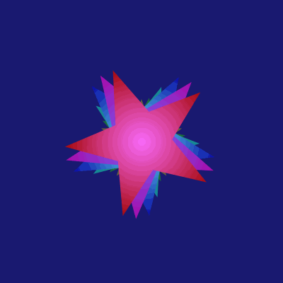

### Blooming Tree

A recursive fractal tree that grows from trunk to full canopy, then sways in the wind. Leaves appear at the tips once fully grown.

```clojure
(defn tree-branches [x y len angle depth max-depth growth sway]
  (when (and (pos? depth) (> growth 0))
    (let [g (min 1.0 (* growth (+ 1.0 (* 0.3 depth))))
          sway-amt (* sway 0.05 depth (Math/sin (* depth 2.3)))
          a (+ angle sway-amt)
          x2 (+ x (* len g (Math/sin a)))
          y2 (- y (* len g (Math/cos a)))
          thickness (max 1 (* 2.5 depth g))
          brown-g (max 0 (min 255 (int (+ 60 (* 15 depth)))))
          branch {:node/type :shape/line
                  :line/from [x y] :line/to [x2 y2]
                  :style/stroke {:color [:color/rgb 90 brown-g 30]
                                 :width thickness :cap :round}}
          left  (tree-branches x2 y2 (* len 0.7) (- a 0.45)
                  (dec depth) max-depth growth sway)
          right (tree-branches x2 y2 (* len 0.7) (+ a 0.45)
                  (dec depth) max-depth growth sway)
          leaf (when (and (<= depth 2) (> g 0.8))
                 [{:node/type :shape/circle
                   :circle/center [x2 y2]
                   :circle/radius (* 3 (- g 0.5))
                   :style/fill [:color/rgb (+ 30 (rand-int 60))
                                (+ 140 (rand-int 80))
                                (+ 20 (rand-int 40))]}])]
      (concat [branch] left right leaf))))

(eido/render
  (anim/frames 90
    (fn [t]
      (let [rng (java.util.Random. 42)
            _ (set! *rand* rng)
            growth (* t 3.0)
            sway (* (max 0 (- t 0.4)) 8.0 (Math/sin (* t 6 Math/PI)))]
        {:image/size [450 450]
         :image/background [:color/rgb 20 20 30]
         :image/nodes (vec (tree-branches 225 420 90 0 9 9 growth sway))})))
  {:output "tree.gif" :fps 24})
```


### Sierpinski Triangle

The classic fractal, built up one recursion depth at a time with shifting colors.

```clojure
(defn sierpinski [ax ay bx by cx cy depth hue-offset t]
  (if (zero? depth)
    (let [hue (mod (+ hue-offset (* t 360)) 360)
          c (color/resolve-color [:color/hsl hue 0.75 0.5])]
      [{:node/type :shape/path
        :path/commands [[:move-to [ax ay]] [:line-to [bx by]]
                        [:line-to [cx cy]] [:close]]
        :style/fill [:color/rgb (:r c) (:g c) (:b c)]}])
    (let [abx (* 0.5 (+ ax bx)) aby (* 0.5 (+ ay by))
          bcx (* 0.5 (+ bx cx)) bcy (* 0.5 (+ by cy))
          acx (* 0.5 (+ ax cx)) acy (* 0.5 (+ ay cy))]
      (concat (sierpinski ax ay abx aby acx acy (dec depth) hue-offset t)
              (sierpinski abx aby bx by bcx bcy (dec depth) (+ hue-offset 25) t)
              (sierpinski acx acy bcx bcy cx cy (dec depth) (+ hue-offset 50) t)))))

(eido/render
  (anim/frames 60
    (fn [t]
      (let [depth (int (Math/floor (+ 1 (* t 6))))]
        {:image/size [500 450]
         :image/background [:color/rgb 20 20 30]
         :image/nodes (vec (sierpinski 250 30 460 410 40 410 depth 0 t))})))
  {:output "sierpinski.gif" :fps 10})
```


### Koch Snowflake

A Koch snowflake that gains detail with each frame, the boundary growing ever more intricate.

```clojure
(defn koch-edge [[x1 y1] [x2 y2] depth]
  (if (zero? depth)
    [[x1 y1] [x2 y2]]
    (let [dx (- x2 x1) dy (- y2 y1)
          ax (+ x1 (/ dx 3)) ay (+ y1 (/ dy 3))
          bx (- x2 (/ dx 3)) by (- y2 (/ dy 3))
          px (+ (* 0.5 (+ ax bx)) (* (/ (Math/sqrt 3) 6) (- y1 y2)))
          py (+ (* 0.5 (+ ay by)) (* (/ (Math/sqrt 3) 6) (- x2 x1)))]
      (concat (koch-edge [x1 y1] [ax ay] (dec depth))
              (koch-edge [ax ay] [px py] (dec depth))
              (koch-edge [px py] [bx by] (dec depth))
              (koch-edge [bx by] [x2 y2] (dec depth))))))

(defn koch-snowflake [cx cy r depth]
  (let [pts (for [i (range 3)]
              (let [a (- (* i (/ (* 2 Math/PI) 3)) (/ Math/PI 2))]
                [(+ cx (* r (Math/cos a))) (+ cy (* r (Math/sin a)))]))
        edges (mapcat #(koch-edge (nth pts %) (nth pts (mod (inc %) 3)) depth)
                      (range 3))
        commands (into [[:move-to (first edges)]]
                       (conj (mapv (fn [p] [:line-to p]) (rest edges))
                             [:close]))]
    {:node/type :shape/path :path/commands commands}))

(eido/render
  (anim/frames 60
    (fn [t]
      (let [depth (int (Math/floor (+ 0.5 (* t 5))))
            c (color/resolve-color [:color/hsl (* t 40) 0.8 0.5])]
        {:image/size [450 450]
         :image/background [:color/rgb 20 20 30]
         :image/nodes
         [(assoc (koch-snowflake 225 235 180 depth)
            :style/fill [:color/rgb (:r c) (:g c) (:b c)])]})))
  {:output "koch.gif" :fps 10})
```


## 3D Gallery

Eido can project 3D shapes into 2D space — no WebGL, no external dependencies, just math. The `eido.scene3d` module builds meshes from pure data and projects them through isometric, orthographic, or perspective projections. The output is ordinary `:shape/path` and `:group` nodes that render through the existing pipeline.

### Utah Teapot

The classic computer graphics test model, loaded from a Wavefront OBJ file via `eido.obj/parse-obj`. The 3,200-quad mesh is centered, scaled, rotated to Y-up, and rendered with an orbiting orthographic camera.

```clojure
(require '[eido.scene3d :as s3d]
         '[eido.obj :as obj]
         '[eido.animate :as anim])

(def teapot
  (-> (obj/parse-obj (slurp "resources/teapot.obj") {})
      (s3d/translate-mesh [-1.085 0.0 -7.875])
      (s3d/scale-mesh 0.1)
      (s3d/rotate-mesh :x (- (/ Math/PI 2)))))

;; Static render
(eido/render
  {:image/size [400 400]
   :image/background [:color/rgb 245 243 238]
   :image/nodes
   [(s3d/render-mesh
      (s3d/isometric {:scale 90 :origin [200 210]})
      (s3d/rotate-mesh teapot :y 0.8)
      {:style {:style/fill [:color/rgb 175 185 195]
               :style/stroke {:color [:color/rgb 135 145 155] :width 0.15}}
       :light {:light/direction [1 2 1]
               :light/ambient 0.3
               :light/intensity 0.7}
       :cull-back false})]}
  {:output "teapot.png"})

;; Orbiting camera animation (camera moves, light stays fixed)
(eido/render
  (anim/frames 90
    (fn [t]
      (let [proj (s3d/orbit (s3d/orthographic {:scale 90 :origin [200 190]})
                            (s3d/mesh-center teapot) 4
                            (* t 2.0 Math/PI) -0.45)]
        {:image/size [400 400]
         :image/background [:color/rgb 245 243 238]
         :image/nodes
         [(s3d/render-mesh proj teapot
            {:style {:style/fill [:color/rgb 175 185 195]
                     :style/stroke {:color [:color/rgb 135 145 155] :width 0.15}}
             :light {:light/direction [1 2 1]
                     :light/ambient 0.3
                     :light/intensity 0.7}
             :cull-back false})]})))
  {:output "teapot.gif" :fps 30})
```

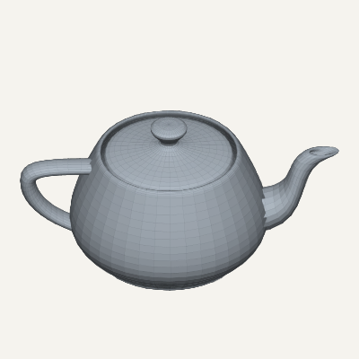
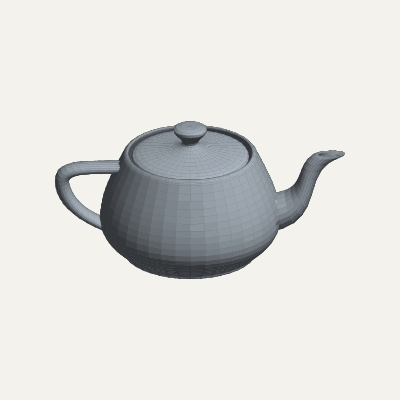

### Rotating Torus

A parametric torus spinning on its axis. Each frame rebuilds the mesh with a new rotation angle — 60 frames rendered as an animated GIF.

```clojure
(def frames
  (anim/frames 60
    (fn [t]
      (let [proj (s3d/isometric {:scale 55 :origin [200 200]})
            mesh (-> (s3d/torus-mesh 1.8 0.7 24 12)
                     (s3d/rotate-mesh :x 0.4)
                     (s3d/rotate-mesh :y (* t 2.0 Math/PI)))]
        {:image/size [400 400]
         :image/background [:color/rgb 20 20 30]
         :image/nodes
         [(s3d/render-mesh proj mesh
            {:style {:style/fill [:color/rgb 220 160 60]
                     :style/stroke {:color [:color/rgb 160 110 30] :width 0.5}}
             :light {:light/direction [1 2 1]
                     :light/ambient 0.2
                     :light/intensity 0.8}
             :cull-back false})]}))))

(eido/render frames {:output "torus.gif" :fps 30})
```

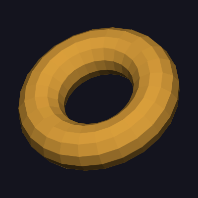

### Isometric Scene

Three primitives in a single isometric scene — a cube, cylinder, and sphere — each with independent colors and shared directional lighting.

```clojure
(let [proj  (s3d/isometric {:scale 35 :origin [200 210]})
      light {:light/direction [1 2 0.5] :light/ambient 0.3 :light/intensity 0.7}]
  (eido/render
    {:image/size [400 400]
     :image/background [:color/rgb 245 243 238]
     :image/nodes
     [(s3d/cube proj [-1.5 0 -1.5] 2
        {:style {:style/fill [:color/rgb 90 140 200]
                 :style/stroke {:color [:color/rgb 50 80 130] :width 0.5}}
         :light light})
      (s3d/cylinder proj [2 0 -1.5] 0.9 2.2
        {:style {:style/fill [:color/rgb 200 100 80]
                 :style/stroke {:color [:color/rgb 130 55 40] :width 0.5}}
         :light light :segments 20})
      (s3d/sphere proj [0 1.3 1.8] 1.0
        {:style {:style/fill [:color/rgb 100 180 100]
                 :style/stroke {:color [:color/rgb 50 110 50] :width 0.3}}
         :light light :segments 16 :rings 8})]}
    {:output "scene.png"}))
```

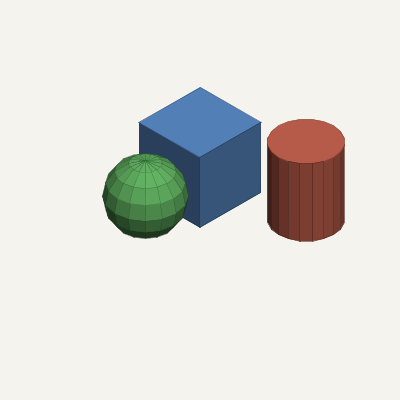

### Rotating Cube

A cube tumbling in space, rendered as an animated GIF. The mesh is rebuilt each frame with new rotation angles applied via `rotate-mesh`.

```clojure
(def frames
  (anim/frames 60
    (fn [t]
      (let [proj  (s3d/isometric {:scale 70 :origin [200 200]})
            mesh  (-> (s3d/cube-mesh [-1 -1 -1] 2)
                      (s3d/rotate-mesh :y (* t 2.0 Math/PI))
                      (s3d/rotate-mesh :x (* t 0.7 Math/PI)))]
        {:image/size [400 400]
         :image/background [:color/rgb 20 20 30]
         :image/nodes
         [(s3d/render-mesh proj mesh
            {:style {:style/fill [:color/rgb 70 130 210]
                     :style/stroke {:color [:color/rgb 140 180 240] :width 1}}
             :light {:light/direction [1 2 0.5]
                     :light/ambient 0.25
                     :light/intensity 0.75}})]}))))

(eido/render frames {:output "cube.gif" :fps 30})
```


### Isometric City

An 8x8 grid of buildings with randomized heights and hue-shifted colors. All 384 faces are combined into a single mesh so the painter's algorithm sorts them correctly across buildings.

```clojure
(let [n 6  spacing 2.4  offset (* -0.5 n spacing)
      proj  (s3d/isometric {:scale 22 :origin [200 220]})
      light {:light/direction [1 3 0.5] :light/ambient 0.3 :light/intensity 0.7}
      rng   (java.util.Random. 42)
      mesh
      (into []
        (for [gx (range n) gz (range n)
              :let [x (+ offset (* gx spacing))
                    z (+ offset (* gz spacing))
                    h (+ 0.8 (* 4.0 (.nextDouble rng)))
                    hue (* 360.0 (/ (+ gx gz) (* 2.0 n)))
                    r (int (+ 110 (* 70 (Math/sin (* hue 0.0174)))))
                    g (int (+ 120 (* 50 (Math/sin (* (+ hue 120) 0.0174)))))
                    b (int (+ 140 (* 60 (Math/sin (* (+ hue 240) 0.0174)))))
                    building (-> (s3d/cube-mesh [0 0 0] 1)
                                 (s3d/scale-mesh [2.0 h 2.0])
                                 (s3d/translate-mesh [x 0 z]))]
              face building]
          (assoc face :face/style
            {:style/fill [:color/rgb r g b]
             :style/stroke {:color [:color/rgb (- r 35) (- g 35) (- b 35)]
                            :width 0.3}})))]
  (eido/render
    {:image/size [400 400]
     :image/background [:color/rgb 225 230 238]
     :image/nodes [(s3d/render-mesh proj mesh {:light light})]}
    {:output "city.png"}))
```

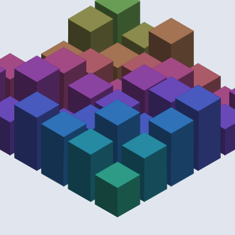

### Torus (static)

A golden torus rendered with fine mesh detail, showing the smooth shading gradient across a curved surface.

```clojure
(let [proj (s3d/isometric {:scale 55 :origin [200 200]})
      mesh (-> (s3d/torus-mesh 1.8 0.7 32 16)
               (s3d/rotate-mesh :x 0.6))]
  (eido/render
    {:image/size [400 400]
     :image/background [:color/rgb 245 243 238]
     :image/nodes
     [(s3d/render-mesh proj mesh
        {:style {:style/fill [:color/rgb 220 170 60]}
         :light {:light/direction [1 2 1]
                 :light/ambient 0.25
                 :light/intensity 0.75}
         :cull-back false})]}
    {:output "torus.png"}))
```

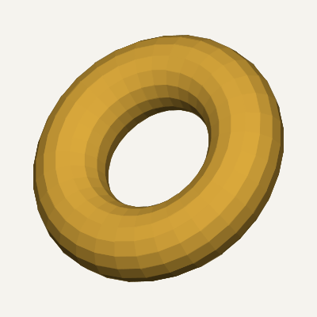

### Wireframe

Any mesh can be rendered as wireframe by passing `:wireframe true` to `render-mesh`. Edges are extracted, deduplicated, and depth-sorted automatically.

```clojure
(eido/render
  {:image/size [400 400]
   :image/background [:color/rgb 245 243 238]
   :image/nodes
   [(s3d/render-mesh
      (s3d/look-at (s3d/orthographic {:scale 55 :origin [200 200]})
                   [3 2.5 4] [0 0 0])
      (s3d/torus-mesh 1.5 0.6 20 10)
      {:wireframe true
       :style {:style/stroke {:color [:color/rgb 60 80 120] :width 0.5}}})]}
  {:output "wireframe.png"})
```

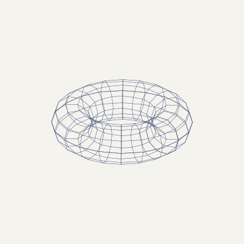

### Camera Controls

The same multi-object scene rendered three ways using the camera utilities — `look-at`, `orbit`, and `fov->distance`. All three functions return ordinary projection maps; no new primitives.

```clojure
;; Shared scene: ground plane + three objects rendered as separate layers.
;; Nodes earlier in :image/nodes draw first (behind), later nodes on top.
(def light {:light/direction [1 2 0.5] :light/ambient 0.3 :light/intensity 0.7})

(defn ground-mesh [size subdivisions]
  (let [half (/ (double size) 2.0)
        step (/ (double size) subdivisions)]
    (into []
      (for [i (range subdivisions) j (range subdivisions)
            :let [x0 (+ (- half) (* i step))
                  z0 (+ (- half) (* j step))
                  x1 (+ x0 step)
                  z1 (+ z0 step)]]
        (s3d/make-face [[x0 0.0 z1] [x1 0.0 z1] [x1 0.0 z0] [x0 0.0 z0]])))))

(def ground (ground-mesh 7 12))
(def ground-style {:style/fill   [:color/rgb 180 175 165]
                   :style/stroke {:color [:color/rgb 165 160 150] :width 0.2}})

(def objects
  (s3d/merge-meshes
    [(s3d/cube-mesh [-1.2 0 -1.2] 1.5)
     {:style/fill [:color/rgb 70 130 200]
      :style/stroke {:color [:color/rgb 40 80 140] :width 0.5}}]
    [(-> (s3d/cylinder-mesh 0.6 2.0 48)
         (s3d/translate-mesh [2.0 0.0 -0.5]))
     {:style/fill [:color/rgb 200 90 70]
      :style/stroke {:color [:color/rgb 200 90 70] :width 0.5}}]
    [(-> (s3d/sphere-mesh 0.7 16 8)
         (s3d/translate-mesh [0.0 0.7 2.0]))
     {:style/fill [:color/rgb 80 180 100]
      :style/stroke {:color [:color/rgb 40 110 50] :width 0.3}}]))

(defn render-scene [proj]
  [(s3d/render-mesh proj ground  {:style ground-style :light light})
   (s3d/render-mesh proj objects {:light light})])
```

**`look-at`** — point the camera from a position toward a target. No manual yaw/pitch math.

```clojure
(eido/render
  {:image/size [400 400]
   :image/background [:color/rgb 245 243 238]
   :image/nodes
   (render-scene
     (s3d/look-at (s3d/orthographic {:scale 55 :origin [200 210]})
                  [4 3.5 6] [0 0.5 0]))}
  {:output "look-at.png"})
```

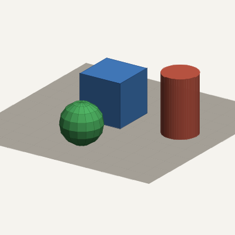

**`orbit`** — camera on a sphere around a target. Pitch convention matches the projection constructors.

```clojure
(eido/render
  (anim/frames 90
    (fn [t]
      {:image/size [400 400]
       :image/background [:color/rgb 245 243 238]
       :image/nodes
       (render-scene
         (s3d/orbit (s3d/orthographic {:scale 55 :origin [200 210]})
                    [0 0.5 0] 8 (* t 2.0 Math/PI) -0.4))}))
  {:output "orbit.gif" :fps 30})
```

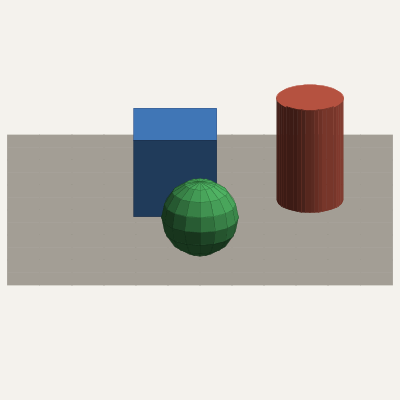

**`fov->distance` + perspective** — field-of-view control for perspective projection. Objects closer to the camera appear larger.

```clojure
(eido/render
  {:image/size [400 400]
   :image/background [:color/rgb 245 243 238]
   :image/nodes
   (render-scene
     (s3d/look-at
       (s3d/perspective {:scale 55 :origin [200 210]
                         :distance (s3d/fov->distance (/ Math/PI 3) (/ 200.0 55))})
       [4 4 7] [0 0.5 0]))}
  {:output "perspective.png"})
```

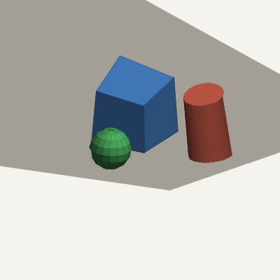

### New Primitives

Cone and torus meshes, combined with `merge-meshes` for multi-object scenes.

```clojure
(let [light {:light/direction [1 2 0.5] :light/ambient 0.3 :light/intensity 0.7}
      proj  (s3d/look-at
              (s3d/perspective {:scale 55 :origin [200 210]
                                :distance (s3d/fov->distance (/ Math/PI 3) (/ 200.0 55))})
              [3 3 5] [0 0.8 0])]
  (eido/render
    {:image/size [400 400]
     :image/background [:color/rgb 245 243 238]
     :image/nodes
     [(s3d/render-mesh proj
        (s3d/merge-meshes
          [(s3d/cone-mesh 0.8 2.0 48)
           {:style/fill [:color/rgb 220 160 60]}]
          [(-> (s3d/torus-mesh 1.2 0.3 48 24)
               (s3d/translate-mesh [0 0.3 0]))
           {:style/fill [:color/rgb 70 130 200]}]
          [(-> (s3d/sphere-mesh 0.5 32 16)
               (s3d/translate-mesh [-2.0 0.5 0.5]))
           {:style/fill [:color/rgb 200 80 80]}])
        {:light light})]}
    {:output "cone-torus.png"}))
```

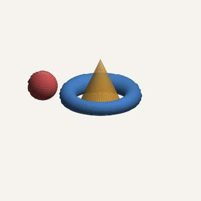

### Wireframe Overlay

Solid shading and wireframe can be combined using composite group opacity. The wireframe layer renders at 40% opacity over the solid torus.

```clojure
(eido/render
  (anim/frames 60
    (fn [t]
      (let [proj (s3d/orbit (s3d/orthographic {:scale 50 :origin [200 200]})
                            [0 0 0] 5 (* t 2.0 Math/PI) -0.3)
            mesh (s3d/torus-mesh 1.5 0.6 20 10)]
        {:image/size [400 400]
         :image/background [:color/rgb 20 20 30]
         :image/nodes
         [(s3d/render-mesh proj mesh
            {:style {:style/fill [:color/rgb 60 100 160]}
             :light {:light/direction [1 2 1]
                     :light/ambient 0.2
                     :light/intensity 0.8}
             :cull-back false})
          {:node/type :group
           :group/composite :src-over
           :node/opacity 0.4
           :group/children
           [(s3d/render-mesh proj mesh
              {:wireframe true
               :style {:style/stroke {:color [:color/rgb 180 210 255]
                                      :width 0.4}}})]}]})))
  {:output "wireframe-overlay.gif" :fps 30})
```

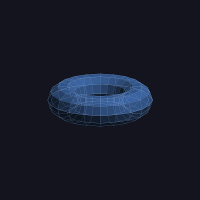

## 2D/3D Gallery

Since `render-mesh` and the convenience functions return ordinary `:group` and `:shape/path` nodes, 3D shapes compose freely with any 2D elements in the same scene.

### Neon Orbit

A rotating 3D torus wreathed in orbiting 2D color halos and pulsing concentric rings.

```clojure
(require '[eido.animate :as anim]
         '[eido.scene :as scene]
         '[eido.scene3d :as s3d])

(eido/render
  (anim/frames 60
    (fn [t]
      (let [cx     250
            cy     250
            angle  (* t 2.0 Math/PI)
            proj   (s3d/perspective
                     {:scale 90 :origin [cx cy]
                      :yaw angle :pitch -0.35 :distance 5.5})
            light  {:light/direction [0.6 1.0 0.4]
                    :light/ambient 0.2 :light/intensity 0.8}
            ;; 3D torus
            torus-3d (s3d/torus proj [0 0 0] 1.8 0.5
                       {:style {:style/fill [:color/rgb 255 50 160]
                                :style/stroke {:color [:color/rgb 255 120 200]
                                               :width 0.4}}
                        :light light
                        :ring-segments 36 :tube-segments 18})
            ;; 2D orbiting halos
            halos (scene/radial 10 cx cy 170
                    (fn [x y a]
                      (let [i     (int (/ (* a 10) (* 2 Math/PI)))
                            pulse (+ 0.5 (* 0.5 (Math/sin (+ angle (* i 0.6)))))
                            hue   (mod (+ (* i 36) (* t 360)) 360)]
                        {:node/type     :shape/circle
                         :circle/center [x y]
                         :circle/radius (+ 6 (* 16 pulse))
                         :node/opacity  (* 0.75 pulse)
                         :style/fill    [:color/hsl hue 0.95 0.6]})))
            ;; 2D pulsing rings
            rings (mapv (fn [i]
                          (let [phase (- (* t 2 Math/PI) (* i 0.4))
                                hue   (mod (+ (* i 50) (* t 120)) 360)]
                            {:node/type     :shape/circle
                             :circle/center [cx cy]
                             :circle/radius (+ 30 (* i 30))
                             :node/opacity  (* 0.2 (+ 0.5 (* 0.5 (Math/sin phase))))
                             :style/stroke  {:color [:color/hsl hue 0.7 0.6]
                                             :width 1.5}}))
                        (range 8))]
        {:image/size       [500 500]
         :image/background [:color/rgb 10 6 22]
         :image/nodes      (into [] (concat rings [torus-3d] halos))})))
  {:output "neon-orbit.gif" :fps 30})
```

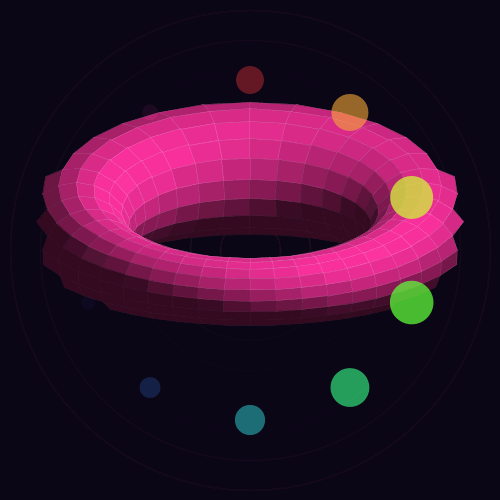

### Crystal Garden

Faceted 3D crystal spires with swaying 2D grass and rising sparkle particles.

```clojure
(eido/render
  (anim/frames 60
    (fn [t]
      (let [proj (s3d/perspective
                   {:scale 70 :origin [300 300]
                    :yaw (* 0.2 (Math/sin (* t 2 Math/PI)))
                    :pitch -0.55 :distance 7.0})
            light {:light/direction [0.0 0.6 1.0]
                   :light/ambient 0.35 :light/intensity 0.65}
            crystals [{:x -2.5 :z 0.3 :h 2.5 :r 0.5  :fill [230 50 180]}
                      {:x -1.0 :z -0.5 :h 3.8 :r 0.6  :fill [40 160 220]}
                      {:x  0.0 :z 0.2 :h 4.5 :r 0.55 :fill [140 60 220]}
                      {:x  1.2 :z -0.3 :h 3.2 :r 0.5  :fill [40 200 140]}
                      {:x  2.3 :z 0.4 :h 4.0 :r 0.55 :fill [220 180 40]}]
            ;; 3D crystal cones with gentle sway
            gems (mapv (fn [{:keys [x z h r fill]}]
                         (let [sway (* 0.15 (Math/sin (+ (* t 3 Math/PI) (* x 0.5))))
                               [cr cg cb] fill
                               mesh (-> (s3d/cone-mesh r h 6)
                                        (s3d/rotate-mesh :z sway)
                                        (s3d/translate-mesh [x 0 z]))]
                           (s3d/render-mesh proj mesh
                             {:style {:style/fill [:color/rgb cr cg cb]
                                      :style/stroke {:color [:color/rgb (+ cr 20) (+ cg 40) (+ cb 20)]
                                                     :width 0.5}}
                              :light light})))
                       crystals)
            ;; 2D grass blades
            grass (mapv (fn [i]
                          (let [gx   (+ 15 (* i 8))
                                gh   (* 14 (+ 0.4 (* 0.6 (Math/sin (+ (* i 0.8) (* t 5))))))
                                sway (* 5 (Math/sin (+ (* i 0.4) (* t 7))))
                                g    (+ 90 (int (* 60 (Math/sin (+ (* i 0.3) 1.0)))))]
                            {:node/type    :shape/line
                             :line/from    [gx 320]
                             :line/to      [(+ gx sway) (- 320 gh)]
                             :style/stroke {:color [:color/rgb 35 g 30] :width 1.5}}))
                        (range 72))
            ;; 2D rising sparkles
            sparkles (mapv (fn [i]
                             (let [phase (mod (+ (* i 0.618) t) 1.0)
                                   hue   (mod (+ (* i 55) (* t 90)) 360)]
                               {:node/type     :shape/circle
                                :circle/center [(+ 100 (* i 90) (* 20 (Math/sin (+ (* i 2.7) (* t 4)))))
                                                (- 310 (* 280 phase))]
                                :circle/radius (+ 1.0 (* 3.5 (- 1.0 phase)))
                                :node/opacity  (* 0.9 (- 1.0 phase))
                                :style/fill    [:color/hsl hue 0.9 0.75]}))
                           (range 6))]
        {:image/size       [600 400]
         :image/background [:color/rgb 8 10 18]
         :image/nodes      (into [] (concat grass gems sparkles))})))
  {:output "crystal-garden.gif" :fps 30})
```

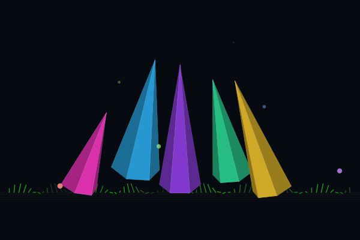

### Solar System

A shaded 3D planet with 2D orbital ellipses, trailing moons, and a twinkling star field.

```clojure
(eido/render
  (anim/frames 60
    (fn [t]
      (let [cx 250 cy 250
            angle (* t 2.0 Math/PI)
            proj  (s3d/perspective
                    {:scale 100 :origin [cx cy]
                     :yaw 0.3 :pitch -0.55 :distance 5.0})
            light {:light/direction [1.0 0.8 0.5]
                   :light/ambient 0.12 :light/intensity 0.88}
            ;; 3D rotating planet
            planet (let [mesh (-> (s3d/sphere-mesh 1.2 24 12)
                                  (s3d/rotate-mesh :y angle))]
                     (s3d/render-mesh proj mesh
                       {:style {:style/fill   [:color/rgb 30 90 190]
                                :style/stroke {:color [:color/rgb 40 110 210]
                                               :width 0.3}}
                        :light light}))
            ;; 2D orbital data
            orbits [{:rx 105 :hue 20 :speed 1.0  :moon-r 7}
                    {:rx 150 :hue 80 :speed 0.7  :moon-r 5}
                    {:rx 195 :hue 160 :speed 0.45 :moon-r 8}
                    {:rx 235 :hue 280 :speed 0.3  :moon-r 4}]
            ;; 2D dashed orbit ellipses
            rings (mapv (fn [{:keys [rx hue]}]
                          {:node/type      :shape/ellipse
                           :ellipse/center [cx cy]
                           :ellipse/rx     rx
                           :ellipse/ry     (* rx 0.35)
                           :node/opacity   0.25
                           :style/stroke   {:color [:color/hsl hue 0.5 0.5]
                                            :width 1 :dash [5 5]}})
                        orbits)
            ;; 2D moon trails
            trails (into []
                     (for [{:keys [rx speed hue]} orbits
                           trail (range 12)]
                       (let [ry (* rx 0.35)
                             ma (- (* angle speed) (* trail 0.06))
                             fade (/ 1.0 (+ 1.0 (* 1.5 trail)))]
                         {:node/type     :shape/circle
                          :circle/center [(+ cx (* rx (Math/cos ma)))
                                          (+ cy (* ry (Math/sin ma)))]
                          :circle/radius (* 3.5 fade)
                          :node/opacity  (* 0.4 fade)
                          :style/fill    [:color/hsl hue 0.7 0.6]})))
            ;; 2D moons
            moons (mapv (fn [{:keys [rx speed moon-r hue]}]
                          (let [ry (* rx 0.35)
                                ma (* angle speed)]
                            {:node/type     :shape/circle
                             :circle/center [(+ cx (* rx (Math/cos ma)))
                                             (+ cy (* ry (Math/sin ma)))]
                             :circle/radius moon-r
                             :style/fill    [:color/hsl hue 0.8 0.55]
                             :style/stroke  {:color [:color/hsl hue 0.6 0.75]
                                             :width 1}}))
                        orbits)
            ;; 2D twinkling stars
            stars (mapv (fn [i]
                          (let [blink (+ 0.2 (* 0.8 (Math/abs
                                                       (Math/sin (+ (* i 1.1) (* t 5))))))]
                            {:node/type     :shape/circle
                             :circle/center [(mod (* i 137.508) 500)
                                             (mod (* i 91.123) 500)]
                             :circle/radius (if (zero? (mod i 9)) 1.8 0.7)
                             :node/opacity  blink
                             :style/fill    [:color/rgb 255 255 255]}))
                        (range 50))]
        {:image/size       [500 500]
         :image/background [:color/rgb 4 4 12]
         :image/nodes      (into [] (concat stars rings trails [planet] moons))})))
  {:output "solar-system.gif" :fps 30})
```

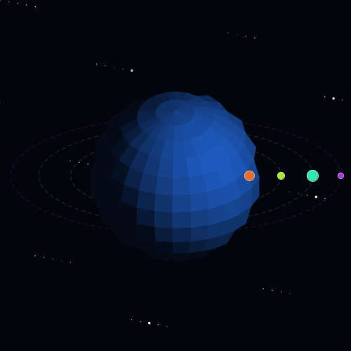

## Particle Gallery

Eido includes a data-driven particle system in `eido.particle`. Particle effects are configured as plain maps — emitter shape, forces, and over-lifetime curves — and `simulate` returns a lazy sequence of node vectors that compose naturally with any other scene elements.

### Configuration

A particle system is a plain map. Every key is optional except the emitter:

```clojure
{:particle/emitter  {:emitter/type :point         ;; :point :line :circle :area :sphere (3D)
                     :emitter/position [x y]      ;; or [x y z] for 3D
                     :emitter/rate 20             ;; particles/sec (continuous)
                     :emitter/burst 50            ;; one-shot count (instead of rate)
                     :emitter/direction [0 -1]    ;; base emission direction
                     :emitter/spread 0.5          ;; angular spread (radians)
                     :emitter/speed [50 150]}     ;; [min max] initial speed
 :particle/lifetime [0.5 2.0]                     ;; [min max] seconds
 :particle/forces   [{:force/type :gravity :force/acceleration [0 98]}
                     {:force/type :drag    :force/coefficient 0.1}
                     {:force/type :wind    :force/direction [1 0]
                                           :force/strength 30}]
 :particle/size     [8 4 1]                       ;; over-lifetime curve (lerped)
 :particle/opacity  [0.0 1.0 1.0 0.0]            ;; over-lifetime curve
 :particle/color    [[:color/rgb 255 200 0]       ;; over-lifetime (via color/lerp)
                     [:color/rgb 255 0 0]]
 :particle/colors   [c1 c2 c3]                    ;; or: random color per particle
 :particle/shape    :circle                       ;; :circle or :rect
 :particle/projection (s3d/perspective {...})      ;; 3D: project through scene3d
 :particle/seed     42                            ;; deterministic PRNG seed
 :particle/max-count 500}                         ;; particle cap
```

Presets are also just maps — customize with `assoc`, `update`, or `merge`:

| Preset | Effect |
|--------|--------|
| `particle/fire` | Upward flames, orange-to-red |
| `particle/confetti` | Colorful burst, gravity + drag |
| `particle/snow` | Gentle drift from line emitter |
| `particle/sparks` | Fast bright burst, short-lived |
| `particle/smoke` | Slow rise, expanding gray clouds |
| `particle/fountain` | Upward spray, gravity arc |

### Campfire

Fire and ember particles over log silhouettes with a pulsing glow.

```clojure
(require '[eido.particle :as particle]
         '[eido.animate :as anim])

(let [;; Fire rising from the base
      fire-frames  (vec (particle/simulate
                          (particle/with-position particle/fire [200 320])
                          60 {:fps 30}))
      ;; Slow-rising embers with a separate seed
      ember-config (-> particle/sparks
                       (particle/with-position [200 325])
                       (particle/with-seed 77)
                       (assoc :particle/emitter
                              {:emitter/type :area
                               :emitter/position [200 325]
                               :emitter/size [60 8]
                               :emitter/rate 8
                               :emitter/direction [0 -1]
                               :emitter/spread 0.6
                               :emitter/speed [20 60]})
                       (assoc :particle/lifetime [1.0 3.0])
                       (assoc :particle/size [1 2 1])
                       (assoc :particle/opacity [0.0 1.0 0.8 0.0])
                       (assoc :particle/color [[:color/rgb 255 200 50]
                                               [:color/rgb 255 120 20]
                                               [:color/rgb 200 60 0]])
                       (assoc :particle/forces
                              [{:force/type :gravity
                                :force/acceleration [0 -20]}
                               {:force/type :wind
                                :force/direction [1 0]
                                :force/strength 5}]))
      ember-frames (vec (particle/simulate ember-config 60 {:fps 30}))]
  (eido/render
    (anim/frames 60
      (fn [t]
        (let [i    (int (* t 59))
              glow (+ 0.15 (* 0.05 (Math/sin (* t 8 Math/PI))))]
          {:image/size [400 400]
           :image/background [:color/rgb 8 5 15]
           :image/nodes
           (into
             [{:node/type :shape/circle
               :circle/center [200 330]
               :circle/radius (+ 80 (* 20 (Math/sin (* t 6 Math/PI))))
               :style/fill [:color/rgb 255 80 0]
               :node/opacity glow}
              {:node/type :shape/rect
               :rect/xy [155 335] :rect/size [90 12]
               :style/fill [:color/rgb 30 15 5]
               :node/transform [[:transform/rotate -0.15]]}
              {:node/type :shape/rect
               :rect/xy [165 340] :rect/size [80 10]
               :style/fill [:color/rgb 25 12 3]
               :node/transform [[:transform/rotate 0.1]]}]
             (concat (nth fire-frames i)
                     (nth ember-frames i)))})))
    {:output "campfire.gif" :fps 30}))
```

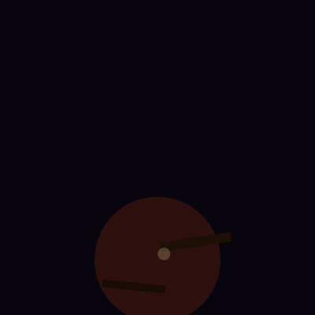

### Fireworks

Three staggered bursts in red, blue, and gold — each a spark preset with custom colors.

```clojure
(let [make-burst
      (fn [pos seed colors]
        (vec (particle/simulate
               (-> particle/sparks
                   (particle/with-position pos)
                   (particle/with-seed seed)
                   (assoc :particle/emitter
                          {:emitter/type :point
                           :emitter/position pos
                           :emitter/burst 60
                           :emitter/direction [0 -1]
                           :emitter/spread Math/PI
                           :emitter/speed [80 250]})
                   (assoc :particle/lifetime [0.5 1.5])
                   (assoc :particle/size [3 4 2 1])
                   (assoc :particle/opacity [1.0 0.9 0.5 0.0])
                   (assoc :particle/color colors))
               90 {:fps 30})))
      burst1 (make-burst [120 150] 11
               [[:color/rgb 255 100 100] [:color/rgb 255 50 50]
                [:color/rgb 200 0 0]])
      burst2 (make-burst [280 120] 22
               [[:color/rgb 100 200 255] [:color/rgb 50 150 255]
                [:color/rgb 0 80 200]])
      burst3 (make-burst [200 180] 33
               [[:color/rgb 255 220 80] [:color/rgb 255 180 0]
                [:color/rgb 200 100 0]])]
  (eido/render
    (anim/frames 90
      (fn [t]
        (let [i (int (* t 89))]
          {:image/size [400 400]
           :image/background [:color/rgb 5 5 15]
           :image/nodes
           (into []
             (concat (nth burst1 i)
                     (if (>= i 10) (nth burst2 (- i 10)) [])
                     (if (>= i 20) (nth burst3 (- i 20)) [])))})))
    {:output "fireworks.gif" :fps 30}))
```

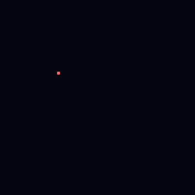

### Snowfall

Gentle snow drifting over moonlit mountain silhouettes.

```clojure
(let [snow-config (-> particle/snow
                      (assoc-in [:particle/emitter :emitter/position] [-20 -10])
                      (assoc-in [:particle/emitter :emitter/position-to] [420 -10])
                      (assoc :particle/max-count 200))
      snow-frames (vec (particle/simulate snow-config 90 {:fps 30}))
      mountain1   [[-10 400] [50 280] [120 310] [160 240] [220 290]
                   [260 220] [300 260] [350 200] [410 300] [410 400]]
      mountain2   [[-10 400] [30 320] [100 340] [180 280] [250 310]
                   [320 260] [380 300] [410 340] [410 400]]]
  (eido/render
    (anim/frames 90
      (fn [t]
        (let [i (int (* t 89))]
          {:image/size [400 400]
           :image/background [:color/rgb 15 20 40]
           :image/nodes
           (into
             [{:node/type :shape/path
               :path/commands (into [[:move-to (first mountain2)]]
                                (conj (mapv (fn [p] [:line-to p])
                                            (rest mountain2))
                                      [:close]))
               :style/fill [:color/rgb 25 35 55]}
              {:node/type :shape/path
               :path/commands (into [[:move-to (first mountain1)]]
                                (conj (mapv (fn [p] [:line-to p])
                                            (rest mountain1))
                                      [:close]))
               :style/fill [:color/rgb 35 45 70]}
              {:node/type :shape/circle
               :circle/center [320 80] :circle/radius 25
               :style/fill [:color/rgb 220 225 240]
               :node/opacity 0.8}
              {:node/type :shape/circle
               :circle/center [320 80] :circle/radius 50
               :style/fill [:color/rgb 180 190 220]
               :node/opacity 0.1}]
             (nth snow-frames i))})))
    {:output "snowfall.gif" :fps 30}))
```


### 3D Fountain with Orbiting Camera

Particles simulated in 3D space, projected through a perspective camera that orbits the scene. Uses `states` and `render-frame` to re-project each frame with a different camera angle. `depth-sort` interleaves particles with mesh faces so pillars correctly occlude particles behind them.

```clojure
(require '[eido.scene3d :as s3d])

(let [config {:particle/emitter {:emitter/type :circle
                                  :emitter/position [0.0 0.0 0.0]
                                  :emitter/radius 0.3
                                  :emitter/rate 50
                                  :emitter/direction [0 1 0]
                                  :emitter/spread 0.25
                                  :emitter/speed [3 6]}
              :particle/lifetime [1.0 2.0]
              :particle/forces [{:force/type :gravity
                                 :force/acceleration [0 -5 0]}]
              :particle/size [2 4 3 1]
              :particle/opacity [0.3 0.9 0.6 0.0]
              :particle/color [[:color/rgb 150 220 255]
                               [:color/rgb 80 160 255]
                               [:color/rgb 30 80 200]]
              :particle/seed 42
              :particle/max-count 300}
      ;; Simulate once — raw states with 3D positions
      sim-states (vec (particle/states config 90 {:fps 30}))
      pillar-positions [[3 0 0] [-3 0 0] [0 0 3] [0 0 -3]
                        [2.1 0 2.1] [-2.1 0 2.1]
                        [2.1 0 -2.1] [-2.1 0 -2.1]]]
  (eido/render
    (anim/frames 90
      (fn [t]
        (let [i    (int (* t 89))
              ;; Camera orbits a full circle
              proj (s3d/perspective {:scale 45 :origin [200 270]
                                     :yaw (* t 2.0 Math/PI)
                                     :pitch -0.4 :distance 10})
              light {:light/direction [0.5 0.8 0.4]
                     :light/ambient 0.25 :light/intensity 0.75}
              ;; Re-render particles with this frame's projection
              particles (particle/render-frame
                          (nth sim-states i) config
                          {:projection proj})
              ;; Static 3D pillars
              pillars (mapv
                        (fn [pos]
                          (s3d/cylinder proj pos 0.25 2.5
                            {:style {:style/fill [:color/rgb 140 120 100]
                                     :style/stroke {:color [:color/rgb 80 70 60]
                                                    :width 0.3}}
                             :light light :segments 8}))
                        pillar-positions)]
          {:image/size [400 400]
           :image/background [:color/rgb 8 8 20]
           ;; depth-sort interleaves particles and mesh faces
           ;; so pillars occlude particles behind them
           :image/nodes (s3d/depth-sort pillars particles)})))
    {:output "fountain-3d.gif" :fps 30}))
```

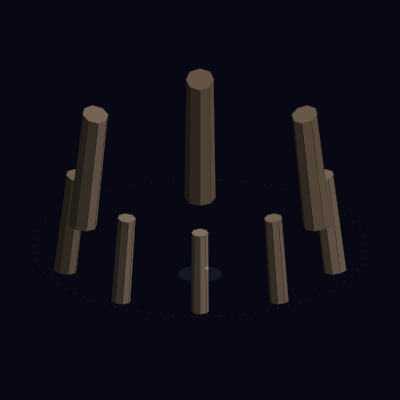

### Volcanic Eruption

3D lava and smoke particles erupting from a `scene3d` cone mesh.

```clojure
(let [proj  (s3d/perspective {:scale 50 :origin [200 340]
                               :yaw 0.3 :pitch -0.2 :distance 10})
      light {:light/direction [0.5 0.8 0.3]
             :light/ambient 0.3 :light/intensity 0.7}

      lava (vec (particle/simulate
                  {:particle/emitter {:emitter/type :sphere
                                      :emitter/position [0 3.5 0]
                                      :emitter/radius 0.4
                                      :emitter/rate 35
                                      :emitter/direction [0 1 0]
                                      :emitter/spread 0.5
                                      :emitter/speed [3 8]}
                   :particle/lifetime [0.6 1.8]
                   :particle/forces [{:force/type :gravity
                                      :force/acceleration [0 -4 0]}]
                   :particle/size [3 5 4 2]
                   :particle/opacity [0.5 1.0 0.8 0.0]
                   :particle/color [[:color/rgb 255 255 150]
                                    [:color/rgb 255 200 20]
                                    [:color/rgb 255 60 0]
                                    [:color/rgb 150 20 0]]
                   :particle/projection proj
                   :particle/seed 42
                   :particle/max-count 250}
                  90 {:fps 30}))

      volcano (s3d/cone proj [0 0 0] 3.0 3.5
                {:style {:style/fill [:color/rgb 80 50 30]
                         :style/stroke {:color [:color/rgb 60 35 20]
                                        :width 0.5}}
                 :light light :segments 16})]

  (eido/render
    (anim/frames 90
      (fn [t]
        {:image/size [400 400]
         :image/background [:color/rgb 12 8 18]
         :image/nodes (into [volcano]
                            (nth lava (int (* t 89))))}))
    {:output "volcano.gif" :fps 30}))
```

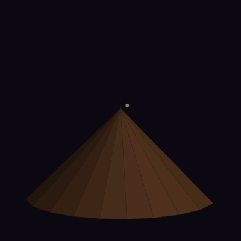

## Typography Gallery

Text in Eido is declared as data and compiled to vector path outlines. This means text works with every existing feature — gradient fills, per-glyph styling, filters, transforms, clipping, compositing, and 3D extrusion — all without additional dependencies.

<p align="center">
  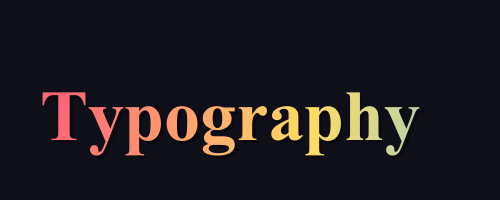
  
</p>
<p align="center">
  
  
</p>
<p align="center">
  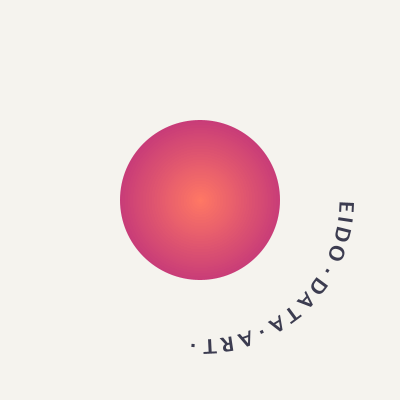
</p>

### Gradient Text with Shadow

Layered text using `text-stack` — a shadow layer offset by a few pixels, then a gradient fill on top.

```clojure
(require '[eido.core :as eido]
         '[eido.scene :as scene])

(eido/render
  {:image/size [500 200]
   :image/background [:color/rgb 15 15 25]
   :image/nodes
   [(scene/text-stack "Typography" [40 140]
      {:font/family "Serif" :font/size 72 :font/weight :bold}
      [;; shadow layer
       {:style/fill [:color/rgba 0 0 0 0.4]
        :node/transform [[:transform/translate 3 3]]}
       ;; gradient fill
       {:style/fill {:gradient/type :linear
                     :gradient/from [0 60]
                     :gradient/to   [500 140]
                     :gradient/stops [[0.0 [:color/rgb 255 100 120]]
                                      [0.5 [:color/rgb 255 220 100]]
                                      [1.0 [:color/rgb 100 200 255]]]}}])]}
  {:output "gradient-text.png"})
```


### Per-Glyph Rainbow

Each glyph styled independently using `:shape/text-glyphs` — here cycling hue by 40° per character.

```clojure
(eido/render
  {:image/size [600 160]
   :image/background [:color/rgb 20 20 35]
   :image/nodes
   [{:node/type    :shape/text-glyphs
     :text/content "CHROMATIC"
     :text/font    {:font/family "SansSerif" :font/size 64 :font/weight :bold}
     :text/origin  [20 110]
     :text/glyphs  (vec (map-indexed
                          (fn [i _]
                            {:glyph/index i
                             :style/fill [:color/hsl (mod (* i 40) 360) 0.85 0.6]})
                          "CHROMATIC"))
     :style/fill   [:color/rgb 255 255 255]}]}
  {:output "rainbow.png"})
```


### Neon Glow

A blurred copy behind crisp text creates a glow effect — using `:group/filter [:blur 8]`.

```clojure
(eido/render
  {:image/size [500 200]
   :image/background [:color/rgb 10 10 20]
   :image/nodes
   [;; glow layer (blurred)
    {:node/type :group
     :group/composite :src-over
     :group/filter [:blur 8]
     :group/children
     [{:node/type   :shape/text
       :text/content "NEON"
       :text/font   {:font/family "SansSerif" :font/size 80 :font/weight :bold}
       :text/origin [70 130]
       :style/fill  [:color/rgb 0 255 200]}]}
    ;; crisp text on top
    {:node/type   :shape/text
     :text/content "NEON"
     :text/font   {:font/family "SansSerif" :font/size 80 :font/weight :bold}
     :text/origin [70 130]
     :style/fill  [:color/rgb 200 255 240]}]}
  {:output "neon.png"})
```


### Animated Circular Text

Text following a circular path, rotating around a gradient sphere. Each frame recomputes the path as a polygon approximating a circle at a different starting angle.

```clojure
(require '[eido.animate :as anim])

(eido/render
  (anim/frames 90
    (fn [t]
      (let [r 130 cx 200 cy 200]
        {:image/size [400 400]
         :image/background [:color/rgb 245 243 238]
         :image/nodes
         [{:node/type :shape/text-on-path
           :text/content "EIDO\u00B7DATA\u00B7ART\u00B7"
           :text/font {:font/family "SansSerif" :font/size 20 :font/weight :bold}
           :text/path (let [steps 64
                            offset (* t 2 Math/PI)]
                        (into [[:move-to [(+ cx (* r (Math/cos offset)))
                                          (+ cy (* r (Math/sin offset)))]]]
                              (map (fn [i]
                                     (let [a (+ offset (* (/ (inc i) steps)
                                                           2 Math/PI))]
                                       [:line-to [(+ cx (* r (Math/cos a)))
                                                   (+ cy (* r (Math/sin a)))]]))
                                   (range steps))))
           :text/spacing 2
           :style/fill [:color/rgb 60 60 80]}
          {:node/type :shape/circle
           :circle/center [cx cy]
           :circle/radius 80
           :style/fill {:gradient/type :radial
                        :gradient/center [cx cy]
                        :gradient/radius 80
                        :gradient/stops [[0.0 [:color/rgb 255 120 100]]
                                          [1.0 [:color/rgb 200 60 120]]]}}]})))
  {:output "circular-text.gif" :fps 30})
```


### Rotating 3D Extruded Text

Each letter is a separate `text-3d` call so they can move independently. Two phase-shifted sine waves drive the vertical bounce and pitch rock, creating a fluid, organic motion.

```clojure
(require '[eido.scene3d :as s3d]
         '[eido.text :as text])

(let [letters "EIDO"
      font {:font/family "SansSerif" :font/size 36 :font/weight :bold}
      glyph-data (text/text->glyph-paths letters font)
      advance (text/text-advance letters font)
      half-w (/ advance 2.0)
      letter-xs (mapv (fn [i]
                        (let [[gx] (:position (nth glyph-data i))
                              next-gx (if (< i (dec (count letters)))
                                        ((:position (nth glyph-data (inc i))) 0)
                                        advance)]
                          (* 3.0 (- (+ gx (/ (- next-gx gx) 2.0)) half-w))))
                      (range (count letters)))
      frames
      (anim/frames 60
        (fn [t]
          {:image/size [600 350]
           :image/background [:color/rgb 20 22 35]
           :image/nodes
           (vec (map-indexed
                  (fn [i c]
                    (let [;; vertical wave (2 cycles)
                          wave (* 20.0 (Math/sin (- (* t 2 Math/PI 2) (* i 1.0))))
                          ;; pitch rock (2 cycles, offset phase)
                          rock (* 0.4 (Math/sin (+ (* t 2 Math/PI 2)
                                                    (* i 1.5) (* Math/PI 0.5))))
                          proj (s3d/perspective
                                 {:scale 3.0
                                  :origin [(+ 300 (nth letter-xs i))
                                           (- 175 wave)]
                                  :yaw 0.0
                                  :pitch (+ (* Math/PI 0.5) rock)
                                  :distance 250})]
                      (s3d/text-3d proj (str c) font 12
                        {:style {:style/fill [:color/rgb 255 140 60]}
                         :light {:light/direction [0 -1 0.5]
                                 :light/ambient 0.25
                                 :light/intensity 0.75}})))
                  letters))}))]
  (eido/render frames {:output "3d-text.gif" :fps 30}))
```


## Compositing

Groups with `:group/composite` render children to an off-screen buffer, then composite the buffer onto the canvas. Without the key, groups behave as before (flattened, zero cost).

### True Group Opacity

Overlapping shapes in a composite group are treated as a single unit — no bleed-through between siblings.

```clojure
{:node/type :group
 :group/composite :src-over
 :node/opacity 0.7
 :group/children
 [{:node/type :shape/circle
   :circle/center [160 100] :circle/radius 60
   :style/fill [:color/rgb 255 80 80]}
  {:node/type :shape/circle
   :circle/center [200 100] :circle/radius 60
   :style/fill [:color/rgb 80 180 255]}
  {:node/type :shape/circle
   :circle/center [240 100] :circle/radius 60
   :style/fill [:color/rgb 80 255 120]}]}
```

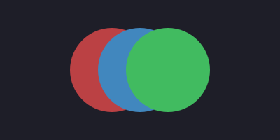

### Masking with `:src-in`

A colored grid masked by a circle — the grid is only visible where the circle was drawn. The outer `:src-over` group isolates from the background; the inner `:src-in` group composites against the circle.

```clojure
{:node/type :group
 :group/composite :src-over
 :group/children
 [{:node/type :shape/circle
   :circle/center [200 200] :circle/radius 150
   :style/fill [:color/rgb 255 255 255]}
  {:node/type :group
   :group/composite :src-in
   :group/children [...colored grid...]}]}
```

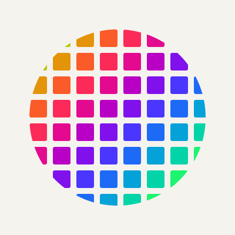

### Composite Modes

| Mode | Effect |
|------|--------|
| `:src-over` | True group opacity — render as unit, then blend |
| `:src-in` | Masking — visible only where destination has pixels |
| `:src-out` | Knockout — visible only where destination is empty |
| `:dst-over` | Draw behind existing content |
| `:xor` | XOR compositing |

### Blend Modes

Custom pixel-by-pixel blending — same `:group/composite` key with blend keywords.

```clojure
;; Screen blend: colored light circles over a 3D scene
{:node/type :group
 :group/composite :screen
 :group/children
 [{:node/type :shape/circle :circle/center [140 180] :circle/radius 120
   :style/fill [:color/rgb 255 60 30] :node/opacity 0.5}
  {:node/type :shape/circle :circle/center [260 160] :circle/radius 100
   :style/fill [:color/rgb 30 100 255] :node/opacity 0.5}]}
```

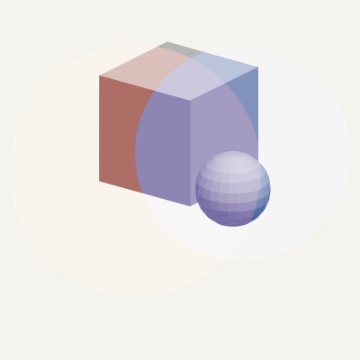

| Mode | Effect |
|------|--------|
| `:multiply` | Darkens — `src * dst` per channel |
| `:screen` | Brightens — `1 - (1-src)(1-dst)` |
| `:overlay` | Multiply or screen based on destination brightness |

### Filters

`:group/filter` applies pixel-level transforms to the compositing buffer. Either key alone triggers buffer creation; both can be combined.

```clojure
;; Animated filter cycle: original → grayscale → sepia → invert
(anim/frames 90
  (fn [t]
    (let [filter-spec (case (int (mod (* t 4) 4))
                        0 nil, 1 :grayscale, 2 :sepia, 3 :invert)]
      {:image/size [400 300]
       :image/background [:color/rgb 245 243 238]
       :image/nodes
       [(cond-> {:node/type :group
                 :group/children [...colored circles...]}
          filter-spec (assoc :group/filter filter-spec))]})))
```

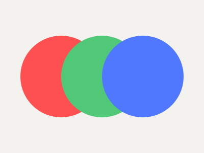

| Filter | Effect |
|--------|--------|
| `:grayscale` | Luminance conversion |
| `:sepia` | Warm-toned monochrome |
| `:invert` | Color negation |
| `[:blur radius]` | Gaussian blur approximation |

### Drop Shadow

No special primitive — composable from blur + offset + opacity:

```clojure
;; Blurred shadow behind a spinning 3D torus
{:node/type :group
 :group/filter [:blur 6]
 :node/opacity 0.3
 :node/transform [[:transform/translate 4 6]]
 :group/children [(s3d/render-mesh proj mesh {:style {:style/fill [:color/rgb 0 0 0]}})]}
```

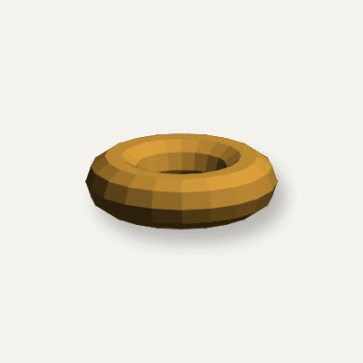

## API

| Function | Description |
|---|---|
| `eido.core/render` | Render scene or animation (opts: :output, :format, :fps, :scale, :dpi, etc.) |
| `eido.core/validate` | Validate scene, returns nil or error vector |
| `eido.core/read-scene` | Read scene from `.edn` file |
| `eido.color/lighten` | Increase lightness of a color vector |
| `eido.color/darken` | Decrease lightness of a color vector |
| `eido.color/saturate` | Increase saturation of a color vector |
| `eido.color/desaturate` | Decrease saturation of a color vector |
| `eido.color/rotate-hue` | Shift hue by degrees |
| `eido.color/lerp` | Interpolate between two color vectors |
| `eido.color/resolve-color` | Color vector to `{:r :g :b :a}` map |
| `eido.color/rgb->hsl` | Convert RGB (0-255) to HSL |
| `eido.scene/grid` | Generate nodes in a grid |
| `eido.scene/distribute` | Distribute nodes along a line |
| `eido.scene/radial` | Distribute nodes around a circle |
| `eido.scene/polygon` | Create closed path from points |
| `eido.scene/triangle` | Create triangle path from 3 points |
| `eido.scene/smooth-path` | Smooth curve through points (Catmull-Rom) |
| `eido.scene/regular-polygon` | Create regular n-sided polygon |
| `eido.scene/star` | Create n-pointed star with inner/outer radii |
| `eido.scene/text` | Create text node (rendered as vector paths) |
| `eido.scene/text-glyphs` | Create per-glyph text node with individual styling |
| `eido.scene/text-on-path` | Create text that follows a path |
| `eido.scene/text-stack` | Create layered text (shadow + outline + fill) |
| `eido.text/text->path-commands` | Convert text string to Eido path commands |
| `eido.text/text->glyph-paths` | Convert text to per-glyph path data |
| `eido.text/text-advance` | Total advance width of rendered text |
| `eido.text/resolve-font` | Resolve font-spec map to java.awt.Font (cached) |
| `eido.text/path-length` | Total arc length of path commands |
| `eido.text/point-at` | Point and tangent angle at distance along path |
| `eido.text/flatten-commands` | Approximate curves as line segments |
| `eido.text/glyph-contours` | Split path commands into closed contours |
| `eido.scene3d/isometric` | Create isometric projection map |
| `eido.scene3d/orthographic` | Create orthographic projection map |
| `eido.scene3d/perspective` | Create perspective projection map |
| `eido.scene3d/look-at` | Orient projection from eye position toward target |
| `eido.scene3d/orbit` | Place camera on sphere around target at yaw/pitch |
| `eido.scene3d/fov->distance` | Convert field-of-view angle to perspective :distance |
| `eido.scene3d/cube-mesh` | 6-face cube mesh at position with size |
| `eido.scene3d/prism-mesh` | Prism from 2D polygon base + height |
| `eido.scene3d/cylinder-mesh` | Cylinder mesh with configurable segments |
| `eido.scene3d/sphere-mesh` | Sphere mesh with lat/lon subdivision |
| `eido.scene3d/torus-mesh` | Torus mesh with major/minor radius |
| `eido.scene3d/cone-mesh` | Cone mesh with base radius and height |
| `eido.scene3d/extrude-mesh` | Extrude 2D polygon along 3D vector |
| `eido.scene3d/make-face` | Create face map from vertices (auto-normal) |
| `eido.scene3d/translate-mesh` | Translate all vertices by offset |
| `eido.scene3d/rotate-mesh` | Rotate mesh around :x, :y, or :z axis |
| `eido.scene3d/scale-mesh` | Scale uniformly or per-axis |
| `eido.scene3d/merge-meshes` | Combine meshes, optionally with per-mesh styling |
| `eido.scene3d/mesh-bounds` | Axis-aligned bounding box {:min :max} |
| `eido.scene3d/mesh-center` | Center point of bounding box |
| `eido.scene3d/render-mesh` | Project mesh to 2D with sorting, culling, shading, wireframe |
| `eido.scene3d/cube` | Convenience: cube-mesh + render-mesh |
| `eido.scene3d/cylinder` | Convenience: cylinder-mesh + render-mesh |
| `eido.scene3d/sphere` | Convenience: sphere-mesh + render-mesh |
| `eido.scene3d/torus` | Convenience: torus-mesh + render-mesh |
| `eido.scene3d/cone` | Convenience: cone-mesh + render-mesh |
| `eido.scene3d/text-mesh` | Extrude glyph outlines into 3D mesh |
| `eido.scene3d/text-3d` | Convenience: text-mesh + render-mesh (centered) |
| `eido.obj/parse-obj` | Parse Wavefront OBJ text to mesh data |
| `eido.obj/parse-mtl` | Parse MTL text to material style maps |
| `eido.math3d/v+` | 3D vector addition |
| `eido.math3d/v-` | 3D vector subtraction |
| `eido.math3d/v*` | 3D scalar multiplication |
| `eido.math3d/dot` | Dot product |
| `eido.math3d/cross` | Cross product |
| `eido.math3d/normalize` | Unit vector |
| `eido.math3d/rotate-x` | Rotate point around X axis |
| `eido.math3d/rotate-y` | Rotate point around Y axis |
| `eido.math3d/rotate-z` | Rotate point around Z axis |
| `eido.math3d/project` | Project 3D point to 2D screen coordinates |
| `user/show` | Preview scene in a window (dev) |
| `user/watch-file` | Auto-reload file on save (dev) |
| `user/watch-scene` | Auto-reload atom on change (dev) |
| `user/install-tap!` | Render tapped scenes (dev) |
| `user/play` | Play animation in preview window (dev) |
| `user/stop` | Stop animation playback (dev) |
| `eido.animate/frames` | Build n frames from (fn [t] ...) |
| `eido.animate/progress` | Normalized frame progress [0, 1] |
| `eido.animate/ping-pong` | Oscillate 0->1->0 |
| `eido.animate/cycle-n` | Multiple cycles within [0, 1] |
| `eido.animate/lerp` | Numeric linear interpolation |
| `eido.animate/ease-in` | Quadratic ease in |
| `eido.animate/ease-out` | Quadratic ease out |
| `eido.animate/ease-in-out` | Quadratic ease in-out |
| `eido.animate/ease-{in,out,in-out}-cubic` | Cubic easing |
| `eido.animate/ease-{in,out,in-out}-quart` | Quartic easing |
| `eido.animate/ease-{in,out,in-out}-expo` | Exponential easing |
| `eido.animate/ease-{in,out,in-out}-circ` | Circular easing |
| `eido.animate/ease-{in,out,in-out}-back` | Overshoot easing |
| `eido.animate/ease-{in,out,in-out}-elastic` | Elastic/spring easing |
| `eido.animate/ease-{in,out,in-out}-bounce` | Bounce easing |
| `eido.animate/stagger` | Per-element staggered progress |
| `eido.particle/simulate` | Run particle simulation, returns lazy seq of node vectors |
| `eido.particle/states` | Run simulation, returns lazy seq of raw particle states |
| `eido.particle/render-frame` | Render a state to nodes (optional projection override) |
| `eido.scene3d/depth-sort` | Sort mixed nodes by depth for correct 3D occlusion |
| `eido.particle/with-position` | Reposition a particle system config |
| `eido.particle/with-seed` | Change the random seed of a config |
| `eido.particle/fire` | Fire preset (data map) |
| `eido.particle/confetti` | Confetti burst preset (data map) |
| `eido.particle/snow` | Snowfall preset (data map) |
| `eido.particle/sparks` | Sparks burst preset (data map) |
| `eido.particle/smoke` | Smoke preset (data map) |
| `eido.particle/fountain` | Fountain preset (data map) |

## Artistic Expression Gallery

Eido includes an artistic toolkit for expressive, stylized rendering — hatching, stippling, variable-width strokes, path distortion, pattern fills, drop shadows, glow effects, path decorators, scatter instancing, noise functions, and color palettes. All features are data-first and compose with every other Eido feature.

<p align="center">
  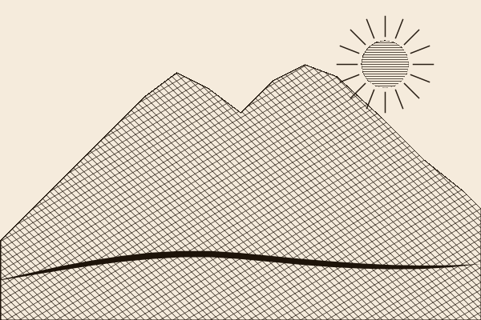
  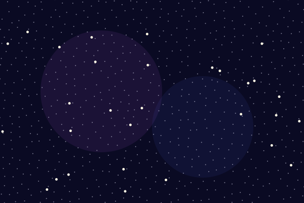
</p>
<p align="center">
  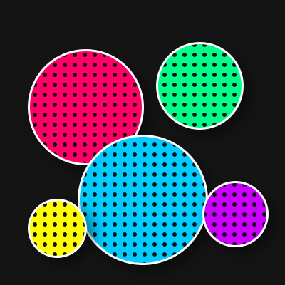
  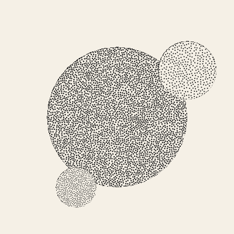
</p>
<p align="center">
  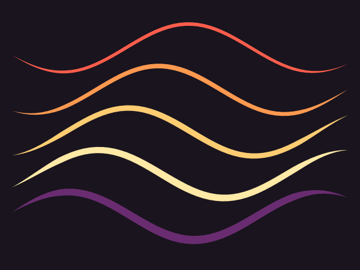
</p>
<p align="center">
  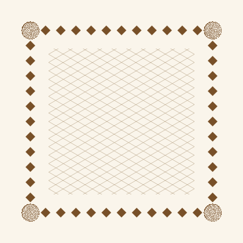
  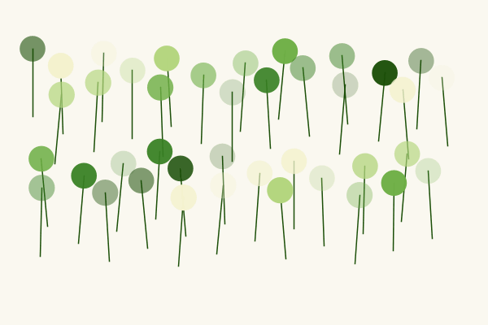
</p>

### Ink Landscape

Combines cross-hatching fill, path distortion (roughen), and variable-width calligraphic strokes to achieve a pen-and-ink aesthetic.

```clojure
(require '[eido.core :as eido])

(eido/render
  {:image/size [600 400]
   :image/background [:color/rgb 245 235 220]
   :image/nodes
   [;; Sun with horizontal hatching
    {:node/type :shape/circle
     :circle/center [480.0 80.0]
     :circle/radius 30.0
     :style/fill {:fill/type :hatch
                  :hatch/angle 0
                  :hatch/spacing 3
                  :hatch/stroke-width 0.8
                  :hatch/color [:color/rgb 40 30 20]
                  :hatch/background [:color/rgb 245 235 220]}
     :style/stroke {:color [:color/rgb 40 30 20] :width 1.5}}
    ;; Mountain with cross-hatching and roughened edges
    {:node/type :shape/path
     :path/commands [[:move-to [0.0 300.0]]
                     [:line-to [220.0 90.0]]
                     [:line-to [380.0 80.0]]
                     [:line-to [600.0 260.0]]
                     [:line-to [600.0 400.0]]
                     [:line-to [0.0 400.0]]
                     [:close]]
     :style/fill {:fill/type :hatch
                  :hatch/layers [{:angle 45 :spacing 6}
                                 {:angle -30 :spacing 8}]
                  :hatch/stroke-width 0.7
                  :hatch/color [:color/rgb 40 30 20]}
     :style/stroke {:color [:color/rgb 30 20 10] :width 2}
     :node/transform [[:transform/distort {:type :roughen :amount 2 :seed 42}]]}
    ;; Calligraphic foreground stroke
    {:node/type :shape/path
     :path/commands [[:move-to [0.0 350.0]]
                     [:curve-to [200.0 310.0] [400.0 330.0] [600.0 330.0]]]
     :stroke/profile :brush
     :style/stroke {:color [:color/rgb 30 20 10] :width 8}}]}
  {:output "ink-landscape.png"})
```


### Pop Art Polka Dots

Pattern fills (tiled mini-scenes) combined with neon palette, white outlines, and drop shadows for a bold pop-art look.

```clojure
(require '[eido.core :as eido]
         '[eido.palette :as palette])

(eido/render
  {:image/size [400 400]
   :image/background [:color/rgb 20 20 20]
   :image/nodes
   [{:node/type :shape/circle
     :circle/center [200.0 200.0]
     :circle/radius 90.0
     :style/fill {:fill/type :pattern
                  :pattern/size [14 14]
                  :pattern/nodes
                  [{:node/type :shape/rect
                    :rect/xy [0.0 0.0]
                    :rect/size [14.0 14.0]
                    :style/fill [:color/rgb 0 255 136]}
                   {:node/type :shape/circle
                    :circle/center [7.0 7.0]
                    :circle/radius 3.0
                    :style/fill [:color/rgb 20 20 20]}]}
     :style/stroke {:color [:color/rgb 255 255 255] :width 3}
     :effect/shadow {:dx 5 :dy 5 :blur 10
                     :color [:color/rgb 0 0 0]
                     :opacity 0.5}}]}
  {:output "polka-pop.png"})
```


### Calligraphic Waves (Animated)

Variable-width strokes with `:pointed` profile animate along sine waves using the sunset palette.

```clojure
(require '[eido.core :as eido]
         '[eido.animate :as anim]
         '[eido.palette :as palette])

(eido/render
  (anim/frames 60
    (fn [t]
      {:image/size [600 450]
       :image/background [:color/rgb 25 20 30]
       :image/nodes
       (vec (for [i (range 5)]
              (let [base-y (+ 80 (* i 70))
                    pts (for [x (range 20 581 10)]
                          [x (+ base-y (* 40 (Math/sin (+ (* x 0.015)
                                                          (* t 2 Math/PI)))))])]
                {:node/type :shape/path
                 :path/commands (into [[:move-to (first pts)]]
                                      (mapv (fn [p] [:line-to p]) (rest pts)))
                 :stroke/profile :pointed
                 :style/stroke {:color (nth (:sunset palette/palettes) (mod i 5))
                                :width (+ 6 (* 2 i))}})))}))
  {:output "calligraphy-flow.gif" :fps 30})
```


### Artistic Toolkit API Reference

| Function / Key | Description |
|---|---|
| `eido.noise/perlin2d` | 2D Perlin noise, seeded, deterministic |
| `eido.noise/perlin3d` | 3D Perlin noise (use time as z for animation) |
| `eido.noise/fbm` | Fractal Brownian motion (layered noise) |
| `eido.noise/turbulence` | Turbulence (absolute-value fbm) |
| `eido.noise/ridge` | Ridged multifractal noise |
| `eido.palette/complementary` | Complementary color (180° opposite) |
| `eido.palette/analogous` | N colors across a 60° arc |
| `eido.palette/triadic` | 3 colors at 120° intervals |
| `eido.palette/split-complementary` | Base + two flanking its complement |
| `eido.palette/tetradic` | 4 colors at 90° intervals |
| `eido.palette/monochromatic` | N colors varying lightness |
| `eido.palette/gradient-palette` | N colors interpolated between two |
| `eido.palette/palettes` | Map of 9 curated palettes |
| `:stroke/profile` | Variable-width stroke (`:pointed`, `:chisel`, `:brush`, or custom `[[t w] ...]`) |
| `:transform/distort` | Path distortion (`:noise`, `:wave`, `:roughen`, `:jitter`) |
| `:fill/type :hatch` | Hatching fill with angle, spacing, cross-hatch layers |
| `:fill/type :stipple` | Stipple fill with Poisson disk sampling |
| `:fill/type :pattern` | Tiled pattern fill from mini-scene |
| `:effect/shadow` | Drop shadow (`{:dx :dy :blur :color :opacity}`) |
| `:effect/glow` | Glow effect (`{:blur :color :opacity}`) |
| `:path/decorated` | Place shapes along a path at intervals |
| `:scatter` | Instance shapes at positions with optional jitter |
| `eido.scatter/grid` | Regular grid positions |
| `eido.scatter/poisson-disk` | Poisson disk sampling positions |
| `eido.scatter/noise-field` | Noise-biased random positions |

## Running Tests

```sh
clj -X:test
```

## Status

v1.0.0-alpha4 — The API is still evolving and may change without notice.
