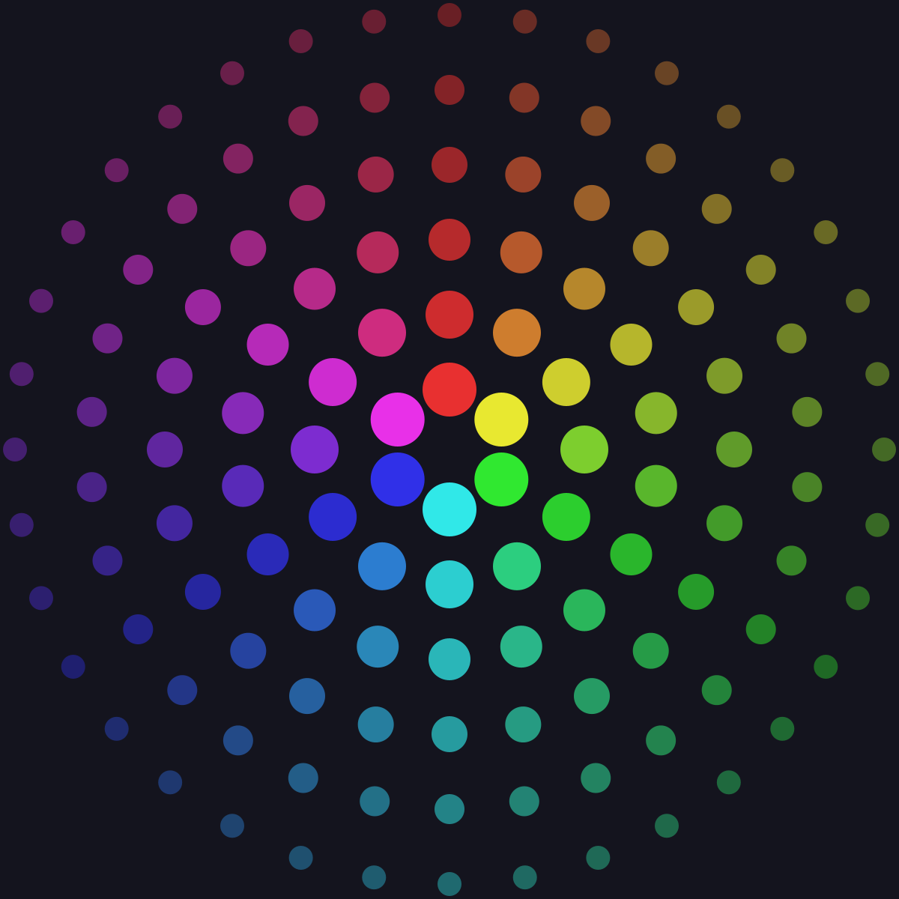
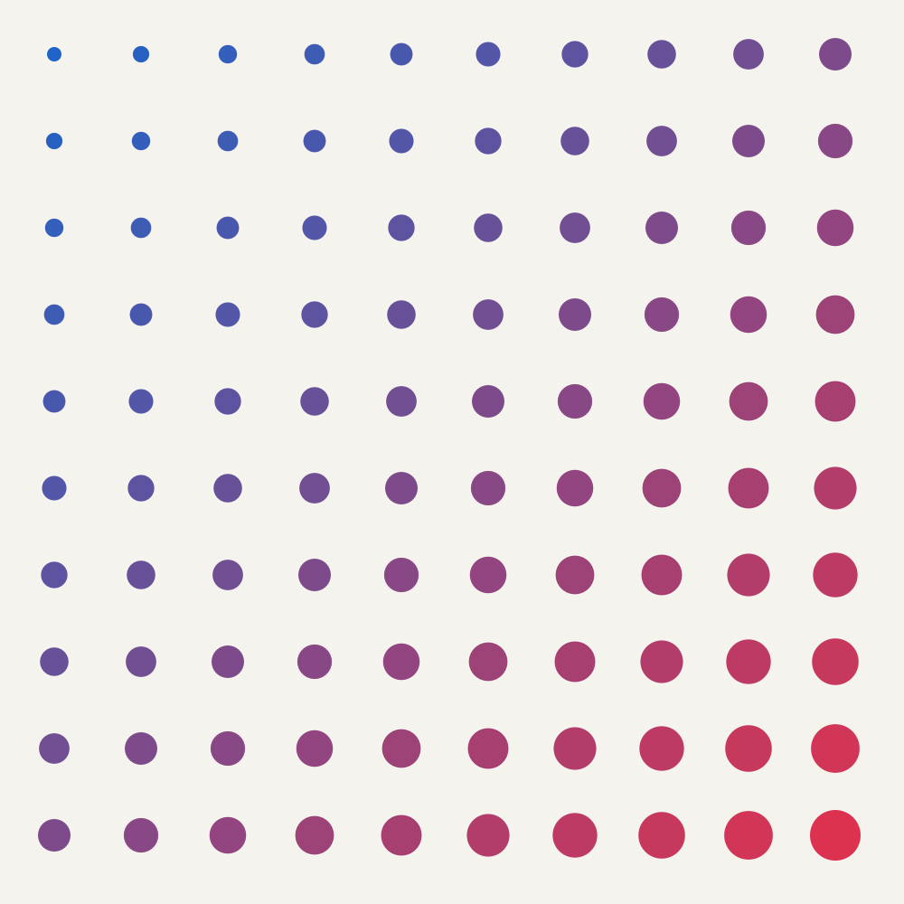
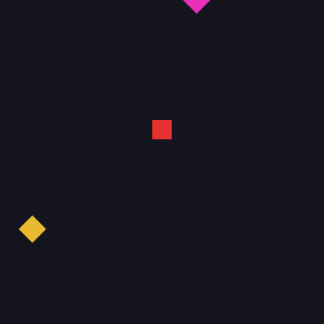

# Eido

**Eido — describe what you see**

Eido is a declarative, EDN-based language for creating 2D images.
Describe the image as data, not drawing instructions.

<p align="center">
  
  
</p>
<p align="center">
  
</p>

## Quick Start

Requires Clojure 1.12+ and Java 11+.

```sh
git clone git@github.com:leifericf/eido.git
cd eido
```

Start a REPL:

```sh
clj -M:dev
```

Render your first image:

```clojure
(require '[eido.core :as eido])

(eido/render-to-file
  {:image/size [400 400]
   :image/background [:color/rgb 245 243 238]
   :image/nodes
   [{:node/type :shape/circle
     :circle/center [200 200]
     :circle/radius 120
     :style/fill {:color [:color/rgb 200 50 50]}}]}
  "circle.png")
```

Or preview interactively in a window:

```clojure
(show {:image/size [400 400]
       :image/background [:color/rgb 245 243 238]
       :image/nodes
       [{:node/type :shape/circle
         :circle/center [200 200]
         :circle/radius 120
         :style/fill {:color [:color/rgb 200 50 50]}}]})
```

## Shapes

Three primitives are available: rectangles, circles, and paths.

```clojure
;; Rectangle
{:node/type :shape/rect
 :rect/xy [50 50]
 :rect/size [200 100]
 :style/fill {:color [:color/rgb 0 128 255]}}

;; Circle
{:node/type :shape/circle
 :circle/center [200 200]
 :circle/radius 80
 :style/stroke {:color [:color/rgb 0 0 0] :width 2}}

;; Path (arbitrary shapes via move/line/curve/close)
{:node/type :shape/path
 :path/commands [[:move-to [100 200]]
                 [:line-to [200 50]]
                 [:line-to [300 200]]
                 [:close]]
 :style/fill {:color [:color/rgb 255 200 50]}}
```

## Composition

Groups compose shapes with shared style, opacity, and transforms.
Styles inherit from parent to child. Opacity multiplies through the tree.

```clojure
{:image/size [400 400]
 :image/background [:color/rgb 255 255 255]
 :image/nodes
 [{:node/type :group
   :node/transform [[:transform/translate 200 200]]
   :style/fill {:color [:color/rgb 255 0 0]}
   :node/opacity 0.8
   :group/children
   [{:node/type :shape/circle
     :circle/center [0 0]
     :circle/radius 80}
    {:node/type :shape/rect
     :rect/xy [-30 -30]
     :rect/size [60 60]
     :style/fill {:color [:color/rgb 0 0 255]}
     :node/opacity 0.5}]}]}
```

## Colors

Multiple color formats are supported:

```clojure
[:color/rgb 255 0 0]            ;; RGB (0-255)
[:color/rgba 255 0 0 0.5]       ;; RGB with alpha (0-1)
[:color/hsl 0 1.0 0.5]          ;; HSL: hue (0-360), saturation (0-1), lightness (0-1)
[:color/hsla 120 0.8 0.5 0.7]   ;; HSL with alpha
[:color/hex "#FF0000"]           ;; Hex (6-digit, 8-digit, 3-digit, 4-digit)
```

Color manipulation helpers operate on resolved color maps:

```clojure
(require '[eido.color :as color])

(def red (color/resolve-color [:color/rgb 255 0 0]))

(color/lighten red 0.2)          ;; lighter red
(color/darken red 0.2)           ;; darker red
(color/saturate red 0.3)         ;; more vivid
(color/desaturate red 0.5)       ;; more muted
(color/rotate-hue red 120)       ;; green
(color/lerp red white 0.5)       ;; blend two colors
```

## Generative Patterns

The `eido.scene` namespace provides helpers for common patterns:

```clojure
(require '[eido.scene :as scene])

;; Grid of circles
(scene/grid 10 10
  (fn [col row]
    {:node/type :shape/circle
     :circle/center [(+ 30 (* col 40)) (+ 30 (* row 40))]
     :circle/radius 15
     :style/fill {:color [:color/rgb (* col 25) (* row 25) 128]}}))

;; Points along a line
(scene/distribute 8 [50 200] [750 200]
  (fn [x y t]
    {:node/type :shape/circle
     :circle/center [x y]
     :circle/radius (+ 5 (* 20 t))
     :style/fill {:color [:color/rgb 0 0 0]}}))

;; Arranged around a circle
(scene/radial 12 200 200 150
  (fn [x y angle]
    {:node/type :shape/rect
     :rect/xy [(- x 10) (- y 10)]
     :rect/size [20 20]
     :node/transform [[:transform/rotate angle]]
     :style/fill {:color [:color/rgb 200 0 0]}}))
```

## File Workflow

Scenes can be stored as `.edn` files and rendered directly:

```clojure
;; Read a scene file
(eido/read-scene "my-scene.edn")

;; Render an EDN file to a BufferedImage
(eido/render-file "my-scene.edn")

;; Watch a file and auto-reload the preview on save
(watch-file "my-scene.edn")

;; Watch an atom for live coding
(def my-scene (atom {...}))
(watch-scene my-scene)
(swap! my-scene assoc-in [:image/nodes 0 :circle/radius] 150)

;; Stop watching
(unwatch)
```

## tap> Integration

Render any scene by tapping it:

```clojure
(install-tap!)
(tap> {:image/size [200 200]
       :image/background [:color/rgb 0 0 0]
       :image/nodes [{:node/type :shape/circle
                      :circle/center [100 100]
                      :circle/radius 60
                      :style/fill {:color [:color/rgb 255 200 50]}}]})
```

## Export

Multiple output formats with options:

```clojure
;; PNG (default)
(eido/render-to-file scene "out.png")

;; JPEG with quality
(eido/render-to-file scene "out.jpg" {:quality 0.9})

;; SVG (scalable vector output)
(eido/render-to-file scene "out.svg")

;; Or get the SVG string directly
(eido/render-to-svg scene)

;; SVG with scale (2x dimensions, same viewBox)
(eido/render-to-svg scene {:scale 2})

;; High-resolution (2x for retina)
(eido/render-to-file scene "out.png" {:scale 2})

;; PNG with DPI metadata
(eido/render-to-file scene "out.png" {:dpi 300})

;; Transparent background (no background fill)
(eido/render-to-file scene "out.png" {:transparent-background true})

;; Batch export — render many scenes at once
(eido/render-batch [{:scene scene-a :path "a.png"}
                    {:scene scene-b :path "b.svg" :opts {:transparent-background true}}])

;; Batch with generator function
(eido/render-batch
  (fn [i] {:scene (make-variation i)
           :path (str "frame-" i ".png")})
  100)
```

Supported formats: PNG, JPEG, GIF, BMP, SVG.

## Validation

Scenes are validated automatically before rendering. Invalid scenes produce clear errors with paths:

```clojure
;; Check a scene without rendering — returns nil if valid, or error vector
(eido/validate {:image/size [800 600]
                :image/background [:color/rgb 255 255 255]
                :image/nodes [{:node/type :shape/rect}]})
;; => [{:path [:image/nodes 0],
;;      :pred "missing required key :rect/xy",
;;      :message "at [:image/nodes 0]: missing required key :rect/xy, got: {:node/type :shape/rect}",
;;      :value {:node/type :shape/rect}}
;;     ...]

;; Rendering an invalid scene throws ex-info with :errors in ex-data
(try
  (eido/render {:bad "scene"})
  (catch Exception e
    (ex-data e)))  ;; => {:errors [{:path ..., :message ..., ...}]}
```

Validates: required keys, value ranges (RGB 0-255, alpha/opacity 0-1, positive dimensions), node types, path commands, color formats, and recursive group structure.

## Animation

Animations are sequences of scenes. Build the frames however you like, then render them as a GIF or a numbered PNG sequence.

```clojure
(require '[eido.animate :as anim])

;; Build 60 frames — each is a plain scene map
(def frames
  (for [i (range 60)]
    (let [t (anim/progress i 60)
          r (anim/lerp 20 80 (anim/ease-in-out (anim/ping-pong t)))]
      {:image/size [200 200]
       :image/background [:color/rgb 30 30 40]
       :image/nodes
       (scene/radial 6 100 100 r
         (fn [x y _]
           {:node/type :shape/circle
            :circle/center [x y]
            :circle/radius 12
            :style/fill {:color [:color/rgb 255 100 50]}}))})))

;; Export as animated GIF (30 fps)
(eido/render-to-gif frames "animation.gif" 30)

;; GIF without looping
(eido/render-to-gif frames "once.gif" 30 {:loop false})

;; Export as animated SVG (SMIL)
(eido/render-to-animated-svg frames "animation.svg" 30)

;; Or get the animated SVG string directly
(eido/render-to-animated-svg-str frames 30)

;; Export as numbered PNG sequence
(eido/render-animation frames "frames/")

;; Custom file prefix
(eido/render-animation frames "frames/" {:prefix "img-"})

;; Preview in REPL window (dev only)
(play frames 30)
(stop)
```

### Animation Helpers

The `eido.animate` namespace provides pure functions for building frame sequences:

```clojure
(anim/progress 15 60)          ;; => 0.25 (normalized frame position)
(anim/ping-pong 0.75)          ;; => 0.5  (oscillate 0->1->0)
(anim/cycle-n 3 0.5)           ;; => 0.5  (3 full cycles)
(anim/lerp 0 100 0.5)          ;; => 50.0 (numeric interpolation)
(anim/ease-in 0.5)             ;; => 0.25 (quadratic ease in)
(anim/ease-out 0.5)            ;; => 0.75 (quadratic ease out)
(anim/ease-in-out 0.5)         ;; => 0.5  (quadratic ease in-out)
(anim/stagger 2 5 0.5 0.3)    ;; per-element progress for staggered animations
```

## API

| Function | Description |
|---|---|
| `eido.core/validate` | Validate scene, returns nil or error vector |
| `eido.core/render` | Scene map to BufferedImage (opts: :scale, :transparent-background) |
| `eido.core/render-to-file` | Scene to file (opts: :format, :quality, :scale, :dpi, :transparent-background) |
| `eido.core/render-to-svg` | Scene to SVG string (opts: :scale, :transparent-background) |
| `eido.core/render-to-gif` | Render scene sequence to animated GIF |
| `eido.core/render-to-animated-svg` | Render scene sequence to animated SVG file |
| `eido.core/render-to-animated-svg-str` | Render scene sequence to animated SVG string |
| `eido.core/render-animation` | Render scene sequence to numbered PNG files |
| `eido.core/render-batch` | Render multiple scenes to files |
| `eido.core/read-scene` | Read scene from `.edn` file |
| `eido.core/render-file` | Render scene from `.edn` file |
| `eido.color/resolve-color` | Color vector to `{:r :g :b :a}` map |
| `eido.color/lighten` | Increase lightness |
| `eido.color/darken` | Decrease lightness |
| `eido.color/saturate` | Increase saturation |
| `eido.color/desaturate` | Decrease saturation |
| `eido.color/rotate-hue` | Shift hue by degrees |
| `eido.color/lerp` | Interpolate between two colors |
| `eido.color/rgb->hsl` | Convert RGB (0-255) to HSL |
| `eido.scene/grid` | Generate nodes in a grid |
| `eido.scene/distribute` | Distribute nodes along a line |
| `eido.scene/radial` | Distribute nodes around a circle |
| `user/show` | Preview scene in a window (dev) |
| `user/watch-file` | Auto-reload file on save (dev) |
| `user/watch-scene` | Auto-reload atom on change (dev) |
| `user/install-tap!` | Render tapped scenes (dev) |
| `user/play` | Play animation in preview window (dev) |
| `user/stop` | Stop animation playback (dev) |
| `eido.animate/progress` | Normalized frame progress [0, 1] |
| `eido.animate/ping-pong` | Oscillate 0->1->0 |
| `eido.animate/cycle-n` | Multiple cycles within [0, 1] |
| `eido.animate/lerp` | Numeric linear interpolation |
| `eido.animate/ease-in` | Quadratic ease in |
| `eido.animate/ease-out` | Quadratic ease out |
| `eido.animate/ease-in-out` | Quadratic ease in-out |
| `eido.animate/stagger` | Per-element staggered progress |

## Running Tests

```sh
clj -X:test
```

## Status

v0.10.0 — Core language complete. Polish pass: API consistency, expanded tests, full spec documentation.
Headed toward v1.0 alpha.

**This is an experiment and a work in progress. The API is not stable and may change without notice.**
