# Eido

**Eido — describe what you see**

Eido is a declarative, EDN-based language for creating 2D images.
Describe the image as data, not drawing instructions.

<p align="center">
  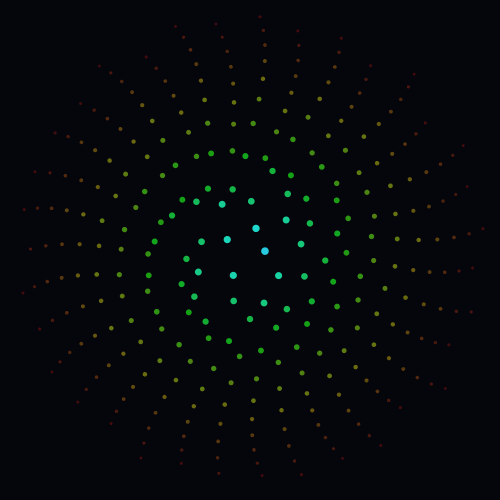
  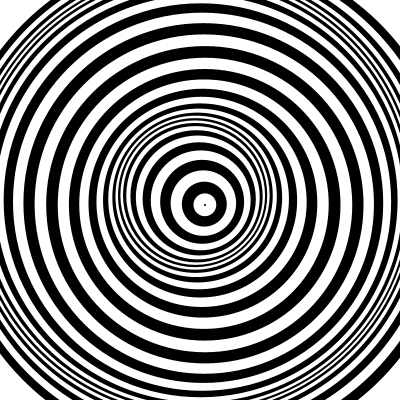
  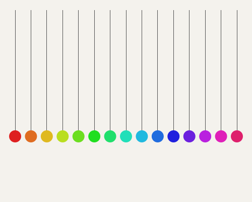
</p>
<p align="center">
  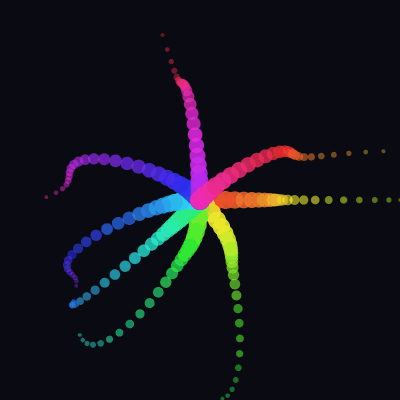
  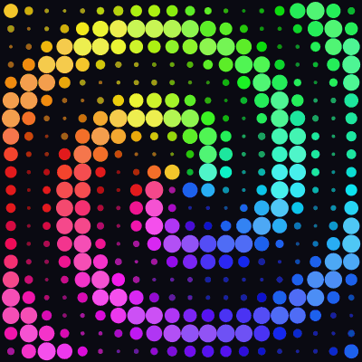
  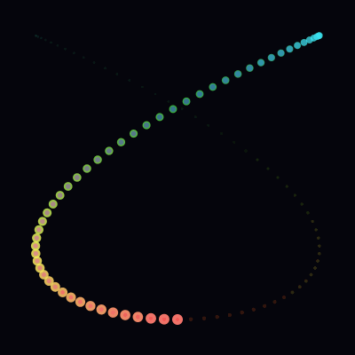
</p>

## Design

This project has been on my mind since I discovered Clojure in 2020. As a graphics nerd, describing images as plain data — not issuing drawing commands — felt like the natural thing to build.

The approach is inspired by Christian Johansen's [Replicant](https://github.com/cjohansen/replicant), which showed how far a minimal, data-first approach to rendering can go. Eido applies similar thinking to 2D image generation.

- **Images are values.** A scene is a plain Clojure map — printable, serializable, diffable. Nothing opaque.
- **One function.** `render` takes a scene (or a sequence of scenes) and produces output. That's the API.
- **Description, not instruction.** You declare what the image contains; eido decides how to draw it. A compile step separates your description from the renderer's execution.
- **Animations are sequences.** 60 frames = 60 maps in a vector. No timeline, no keyframes, no mutation.
- **No state, no framework.** Every function takes data and returns data. You bring your own workflow.
- **Zero dependencies.** Just Clojure and the standard library.

If it cannot be represented as plain data, it probably should not be in the library.

## Quick Start

Requires Clojure 1.12+ and Java 11+.

```sh
git clone git@github.com:leifericf/eido.git
cd eido
```

Start a REPL:

```sh
clj -M:dev
```

Render your first image:

```clojure
(require '[eido.core :as eido])

(eido/render
  {:image/size [400 400]
   :image/background [:color/rgb 245 243 238]
   :image/nodes
   [{:node/type :shape/circle
     :circle/center [200 200]
     :circle/radius 120
     :style/fill [:color/rgb 200 50 50]}]}
  {:output "circle.png"})
```

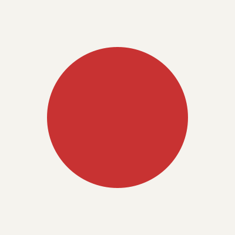

Or preview interactively in a window:

```clojure
(show {:image/size [400 400]
       :image/background [:color/rgb 245 243 238]
       :image/nodes
       [{:node/type :shape/circle
         :circle/center [200 200]
         :circle/radius 120
         :style/fill [:color/rgb 200 50 50]}]})
```

## Shapes

Three primitives are available: rectangles, circles, and paths.

```clojure
;; Rectangle
{:node/type :shape/rect
 :rect/xy [50 50]
 :rect/size [200 100]
 :style/fill [:color/rgb 0 128 255]}

;; Circle
{:node/type :shape/circle
 :circle/center [200 200]
 :circle/radius 80
 :style/stroke {:color [:color/rgb 0 0 0] :width 2}}

;; Path (arbitrary shapes via move/line/curve/close)
{:node/type :shape/path
 :path/commands [[:move-to [100 200]]
                 [:line-to [200 50]]
                 [:line-to [300 200]]
                 [:close]]
 :style/fill [:color/rgb 255 200 50]}
```

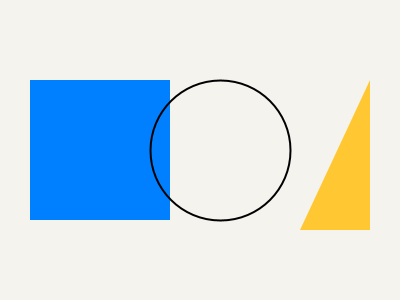

## Composition

Groups compose shapes with shared style, opacity, and transforms.
Styles inherit from parent to child. Opacity multiplies through the tree.

```clojure
{:image/size [400 400]
 :image/background [:color/rgb 255 255 255]
 :image/nodes
 [{:node/type :group
   :node/transform [[:transform/translate 200 200]]
   :style/fill [:color/rgb 255 0 0]
   :node/opacity 0.8
   :group/children
   [{:node/type :shape/circle
     :circle/center [0 0]
     :circle/radius 80}
    {:node/type :shape/rect
     :rect/xy [-30 -30]
     :rect/size [60 60]
     :style/fill [:color/rgb 0 0 255]
     :node/opacity 0.5}]}]}
```

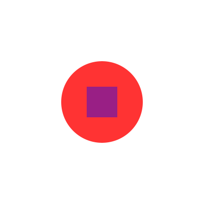

## Colors

Multiple color formats are supported:

```clojure
[:color/rgb 255 0 0]            ;; RGB (0-255)
[:color/rgba 255 0 0 0.5]       ;; RGB with alpha (0-1)
[:color/hsl 0 1.0 0.5]          ;; HSL: hue (0-360), saturation (0-1), lightness (0-1)
[:color/hsla 120 0.8 0.5 0.7]   ;; HSL with alpha
[:color/hex "#FF0000"]           ;; Hex (6-digit, 8-digit, 3-digit, 4-digit)
```

All color formats work directly in style maps — no manual resolution needed:

```clojure
{:style/fill [:color/hsl 200 0.9 0.5]}   ;; HSL straight in the scene
{:style/fill [:color/hex "#FF6B35"]}      ;; hex too
```

Color manipulation helpers accept and return color vectors:

```clojure
(require '[eido.color :as color])

(color/lighten [:color/rgb 255 0 0] 0.2)          ;; lighter red
(color/darken [:color/rgb 255 0 0] 0.2)           ;; darker red
(color/saturate [:color/rgb 150 100 100] 0.3)     ;; more vivid
(color/desaturate [:color/rgb 255 0 0] 0.5)       ;; more muted
(color/rotate-hue [:color/rgb 255 0 0] 120)       ;; green
(color/lerp [:color/rgb 0 0 0] [:color/rgb 255 255 255] 0.5) ;; blend
```

## Generative Patterns

The `eido.scene` namespace provides helpers for common patterns:

```clojure
(require '[eido.scene :as scene])

;; Grid of circles
(scene/grid 10 10
  (fn [col row]
    {:node/type :shape/circle
     :circle/center [(+ 30 (* col 40)) (+ 30 (* row 40))]
     :circle/radius 15
     :style/fill [:color/rgb (* col 25) (* row 25) 128]}))
```

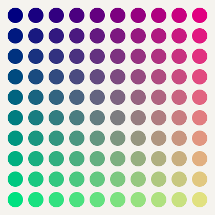

```clojure
;; Points along a line
(scene/distribute 8 [50 200] [750 200]
  (fn [x y t]
    {:node/type :shape/circle
     :circle/center [x y]
     :circle/radius (+ 5 (* 20 t))
     :style/fill [:color/rgb 0 0 0]}))
```

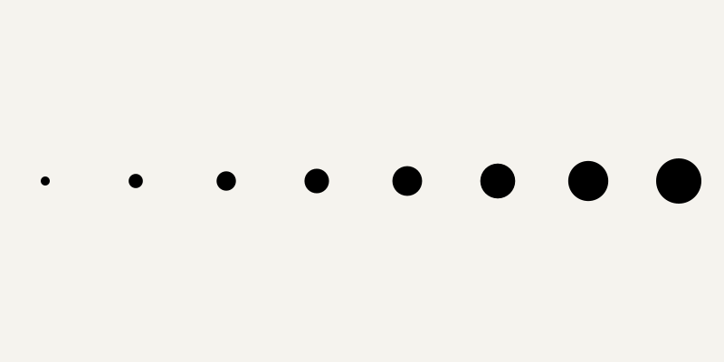

```clojure
;; Arranged around a circle
(scene/radial 12 200 200 120
  (fn [x y _angle]
    {:node/type :shape/circle
     :circle/center [x y]
     :circle/radius 15
     :style/fill [:color/rgb 200 0 0]}))
```

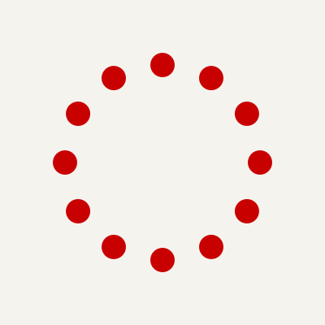

## File Workflow

Scenes can be stored as `.edn` files and rendered directly:

```clojure
;; Read a scene file and render
(eido/render (eido/read-scene "my-scene.edn") {:output "out.png"})

;; Watch a file and auto-reload the preview on save
(watch-file "my-scene.edn")

;; Watch an atom for live coding
(def my-scene (atom {...}))
(watch-scene my-scene)
(swap! my-scene assoc-in [:image/nodes 0 :circle/radius] 150)

;; Stop watching
(unwatch)
```

## tap> Integration

Render any scene by tapping it:

```clojure
(install-tap!)
(tap> {:image/size [200 200]
       :image/background [:color/rgb 0 0 0]
       :image/nodes [{:node/type :shape/circle
                      :circle/center [100 100]
                      :circle/radius 60
                      :style/fill [:color/rgb 255 200 50]}]})
```

## Export

All output goes through `render`:

```clojure
;; PNG (default)
(eido/render scene {:output "out.png"})

;; JPEG with quality
(eido/render scene {:output "out.jpg" :quality 0.9})

;; SVG (scalable vector output)
(eido/render scene {:output "out.svg"})

;; SVG string (no file)
(eido/render scene {:format :svg})

;; High-resolution (2x for retina)
(eido/render scene {:output "out.png" :scale 2})

;; PNG with DPI metadata
(eido/render scene {:output "out.png" :dpi 300})

;; Transparent background (no background fill)
(eido/render scene {:output "out.png" :transparent-background true})

;; BufferedImage (no output path)
(eido/render scene)
(eido/render scene {:scale 2})
```

Supported formats: PNG, JPEG, GIF, BMP, SVG.

## Validation

Scenes are validated automatically before rendering. Invalid scenes produce clear errors with paths:

```clojure
;; Check without rendering — returns nil if valid, or error vector
(eido/validate {:image/size [800 600]
                :image/background [:color/rgb 255 255 255]
                :image/nodes [{:node/type :shape/rect}]})
;; => [{:path [:image/nodes 0],
;;      :pred "missing required key :rect/xy", ...}]

;; Rendering an invalid scene throws ex-info with :errors in ex-data
(try
  (eido/render {:bad "scene"})
  (catch Exception e
    (ex-data e)))  ;; => {:errors [...]}
```

## Animation

Animations are sequences of scenes. Build the frames however you like, then render.

```clojure
(require '[eido.animate :as anim])

;; Build 60 frames — each is a plain scene map
(def frames
  (for [i (range 60)]
    (let [t (anim/progress i 60)
          r (anim/lerp 20 80 (anim/ease-in-out (anim/ping-pong t)))]
      {:image/size [200 200]
       :image/background [:color/rgb 30 30 40]
       :image/nodes
       (scene/radial 6 100 100 r
         (fn [x y _]
           {:node/type :shape/circle
            :circle/center [x y]
            :circle/radius 12
            :style/fill [:color/rgb 255 100 50]}))})))

```


```clojure
;; Export as animated GIF (30 fps)
(eido/render frames {:output "animation.gif" :fps 30})

;; GIF without looping
(eido/render frames {:output "once.gif" :fps 30 :loop false})

;; Export as animated SVG (SMIL)
(eido/render frames {:output "animation.svg" :fps 30})

;; Animated SVG string (no file)
(eido/render frames {:format :svg :fps 30})

;; Export as numbered PNG sequence
(eido/render frames {:output "frames/" :fps 30})

;; Custom file prefix
(eido/render frames {:output "frames/" :fps 30 :prefix "img-"})

;; Preview in REPL window (dev only)
(play frames 30)
(stop)
```

### Animation Helpers

The `eido.animate` namespace provides pure functions for building frame sequences:

```clojure
(anim/progress 15 60)          ;; => 0.25 (normalized frame position)
(anim/ping-pong 0.75)          ;; => 0.5  (oscillate 0->1->0)
(anim/cycle-n 3 0.5)           ;; => 0.5  (3 full cycles)
(anim/lerp 0 100 0.5)          ;; => 50.0 (numeric interpolation)
(anim/ease-in 0.5)             ;; => 0.25 (quadratic ease in)
(anim/ease-out 0.5)            ;; => 0.75 (quadratic ease out)
(anim/ease-in-out 0.5)         ;; => 0.5  (quadratic ease in-out)
(anim/stagger 2 5 0.5 0.3)    ;; per-element progress for staggered animations
```

## Gallery

These examples combine grids, color manipulation, and animation helpers to create patterns that would be difficult to produce without code.

### Spiral Rainbow

A rotating spiral wave where hue follows the angle and pulse follows the distance from center.

```clojure
(def frames
  (for [i (range 60)]
    (let [t (anim/progress i 60)]
      {:image/size [400 400]
       :image/background [:color/rgb 10 10 18]
       :image/nodes
       (scene/grid 20 20
         (fn [col row]
           (let [cx (- (/ col 9.5) 1.0)
                 cy (- (/ row 9.5) 1.0)
                 dist (Math/sqrt (+ (* cx cx) (* cy cy)))
                 angle (Math/atan2 cy cx)
                 spiral (mod (+ (* dist 2.0)
                                (* angle (/ 1.0 Math/PI))
                                (- (* t 3.0))) 1.0)
                 pulse (/ (+ 1.0 (Math/sin (* spiral 2.0 Math/PI))) 2.0)
                 radius (+ 2 (* 8 pulse))
                 hue (mod (+ (* angle (/ 180.0 Math/PI)) 180 (* t 360)) 360)]
             {:node/type :shape/circle
              :circle/center [(+ 12 (* col 19.8)) (+ 12 (* row 19.8))]
              :circle/radius radius
              :style/fill [:color/hsl hue 0.9 (+ 0.3 (* 0.35 pulse))]})))})))

(eido/render frames {:output "spiral.gif" :fps 24})
```


### Sine Interference

Three overlapping sine waves at different frequencies create organic, shifting patterns.

```clojure
(def frames
  (for [i (range 50)]
    (let [t (anim/progress i 50)]
      {:image/size [400 400]
       :image/background [:color/rgb 10 10 18]
       :image/nodes
       (scene/grid 20 20
         (fn [col row]
           (let [x (/ col 19.0)
                 y (/ row 19.0)
                 v (/ (+ (Math/sin (+ (* x 8) (* t 2 Math/PI)))
                         (Math/sin (+ (* y 6) (* t 2 Math/PI 1.3)))
                         (Math/sin (+ (* (+ x y) 5) (* t 2 Math/PI 0.7)))) 3.0)
                 pulse (/ (+ v 1.0) 2.0)
                 radius (+ 3 (* 7 pulse))
                 hue (mod (+ (* pulse 200) (* t 360) 180) 360)]
             {:node/type :shape/circle
              :circle/center [(+ 12 (* col 19.8)) (+ 12 (* row 19.8))]
              :circle/radius radius
              :style/fill [:color/hsl hue 0.9 (+ 0.35 (* 0.3 pulse))]})))})))

(eido/render frames {:output "sine-field.gif" :fps 24})
```

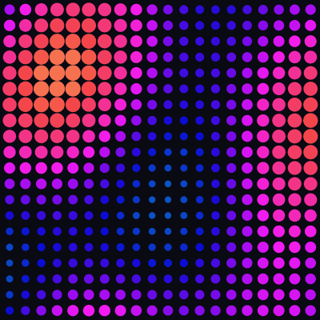

### Breathing Wave

A diagonal wave where cells expand and contract with staggered timing, hue shifting along the diagonal.

```clojure
(def frames
  (for [i (range 50)]
    (let [t (anim/progress i 50)]
      {:image/size [400 400]
       :image/background [:color/rgb 245 243 238]
       :image/nodes
       (scene/grid 14 14
         (fn [col row]
           (let [delay (/ (+ col row) 26.0)
                 phase (mod (- (* t 2.0) delay) 1.0)
                 breath (/ (+ 1.0 (Math/sin (* phase 2.0 Math/PI))) 2.0)
                 size (+ 3 (* 10 breath))
                 hue (mod (+ (* (+ col row) 14) (* t 120)) 360)]
             {:node/type :shape/circle
              :circle/center [(+ 18 (* col 27)) (+ 18 (* row 27))]
              :circle/radius size
              :style/fill [:color/hsl hue (+ 0.5 (* 0.4 breath)) 0.48]})))})))

(eido/render frames {:output "breathing.gif" :fps 24})
```

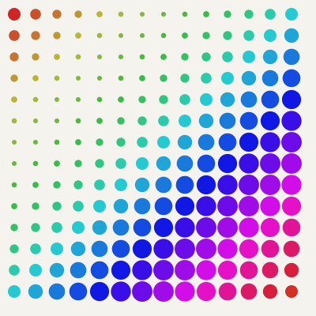

### Dancing Bars

Vertical bars with height, position, and color driven by overlapping sine waves.

```clojure
(def frames
  (for [i (range 50)]
    (let [t (anim/progress i 50)]
      {:image/size [400 400]
       :image/background [:color/rgb 10 10 18]
       :image/nodes
       (vec (for [col (range 30)]
              (let [x-norm (/ col 29.0)
                    wave1 (Math/sin (+ (* x-norm 4 Math/PI) (* t 2 Math/PI)))
                    wave2 (Math/sin (+ (* x-norm 6 Math/PI) (* t 2 Math/PI 1.7)))
                    combined (/ (+ wave1 wave2) 2.0)
                    height (+ 40 (* 140 (/ (+ combined 1.0) 2.0)))
                    y-center (+ 200 (* 60 (Math/sin (+ (* x-norm 3 Math/PI)
                                                        (* t 2 Math/PI 0.5)))))
                    width (+ 4 (* 6 (/ (+ combined 1.0) 2.0)))
                    hue (mod (+ (* x-norm 360) (* t 200)) 360)]
                {:node/type :shape/rect
                 :rect/xy [(- (* (+ 0.5 col) (/ 400.0 30)) (/ width 2))
                            (- y-center (/ height 2))]
                 :rect/size [width height]
                 :style/fill [:color/hsl hue 0.85
                               (+ 0.35 (* 0.3 (/ (+ combined 1.0) 2.0)))]})))})))

(eido/render frames {:output "dancing-bars.gif" :fps 24})
```

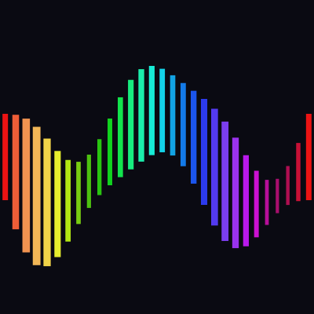

### Tentacles

Eight arms spiral outward from the center, wobbling and shifting color along their length.

```clojure
(def frames
  (for [i (range 60)]
    (let [t (anim/progress i 60)]
      {:image/size [400 400]
       :image/background [:color/rgb 10 10 18]
       :image/nodes
       (vec (for [arm (range 8)]
              (let [base-angle (+ (* arm (/ (* 2 Math/PI) 8)) (* t Math/PI 0.3))
                    hue (* arm 45)]
                {:node/type :group
                 :group/children
                 (vec (for [seg (range 25)]
                        (let [seg-t (/ seg 24.0)
                              r (* seg-t 180)
                              wobble (* 30 seg-t
                                       (Math/sin (+ (* seg-t 8) (* t 2 Math/PI)
                                                    (* arm 0.7))))
                              angle (+ base-angle
                                       (* seg-t 0.8
                                          (Math/sin (+ (* t 2 Math/PI) arm))))
                              x (+ 200 (* (+ r wobble) (Math/cos angle)))
                              y (+ 200 (* (+ r wobble) (Math/sin angle)))
                              size (max 1 (- 10 (* seg-t 8)))
                              seg-hue (mod (+ hue (* seg-t 90) (* t 120)) 360)]
                          {:node/type :shape/circle
                           :circle/center [x y]
                           :circle/radius size
                           :node/opacity (- 1.0 (* seg-t 0.6))
                           :style/fill [:color/hsl seg-hue 0.85 0.55]})))})))})))

(eido/render frames {:output "tentacles.gif" :fps 24})
```


### Pendulum Wave

15 pendulums with increasing frequencies create wave patterns. Uses paths for strings and circles for bobs.

```clojure
(def frames
  (for [i (range 80)]
    (let [t (anim/progress i 80)]
      {:image/size [500 400]
       :image/background [:color/rgb 245 243 238]
       :image/nodes
       (vec (for [p (range 15)]
              (let [freq (+ 6 p)
                    angle (* (Math/sin (* t 2 Math/PI freq)) 0.9)
                    pivot-x (+ 30 (* p 31.4))
                    bob-x (+ pivot-x (* 250 (Math/sin angle)))
                    bob-y (* 250 (Math/cos angle))
                    hue (* p 24)]
                {:node/type :group
                 :group/children
                 [{:node/type :shape/path
                   :path/commands [[:move-to [pivot-x 20]]
                                   [:line-to [bob-x (+ 20 bob-y)]]]
                   :style/stroke {:color [:color/rgb 80 80 80] :width 1}}
                  {:node/type :shape/circle
                   :circle/center [bob-x (+ 20 bob-y)]
                   :circle/radius 10
                   :style/fill [:color/hsl hue 0.75 0.5]}]})))})))

(eido/render frames {:output "pendulum-wave.gif" :fps 30})
```


### Particle Galaxy

300 particles orbiting with Keplerian speeds and 3 spiral arms.

```clojure
(def frames
  (for [i (range 60)]
    (let [t (anim/progress i 60)]
      {:image/size [500 500]
       :image/background [:color/rgb 5 5 12]
       :image/nodes
       (vec (for [p (range 300)]
              (let [arm (mod p 3)
                    base-r (+ 15 (* (Math/sqrt (/ p 300.0)) 220))
                    speed (/ 1.0 (Math/sqrt (max 1 base-r)))
                    angle (+ (* t 2 Math/PI speed 3)
                             (/ (* p 137.508) 50.0)
                             (* arm (/ (* 2 Math/PI) 3))
                             (* (/ base-r 300.0) 1.5))
                    r (+ base-r (* 8 (Math/sin (+ (* t 6 Math/PI) (* p 137.508)))))
                    x (+ 250 (* r (Math/cos angle)))
                    y (+ 250 (* r (Math/sin angle)))
                    hue (mod (+ 200 (* -200 (/ base-r 230.0))) 360)
                    bright (- 1.0 (* 0.5 (/ base-r 230.0)))
                    size (max 1 (- 4 (* 2.5 (/ base-r 230.0))))]
                {:node/type :shape/circle
                 :circle/center [x y]
                 :circle/radius size
                 :node/opacity (min 1.0 bright)
                 :style/fill [:color/hsl hue 0.8 (* 0.55 bright)]})))})))

(eido/render frames {:output "galaxy.gif" :fps 24})
```


### Op Art

Concentric rings that wobble to create an optical illusion, using only black and white.

```clojure
(def frames
  (for [i (range 50)]
    (let [t (anim/progress i 50)]
      {:image/size [400 400]
       :image/background [:color/rgb 255 255 255]
       :image/nodes
       (vec (for [ring (reverse (range 40))]
              (let [phase (+ (* t 2 Math/PI) (* ring 0.3))
                    wobble (* 15 (Math/sin phase))
                    r (+ (* ring 7) wobble)]
                {:node/type :shape/circle
                 :circle/center [(+ 200 (* 5 (Math/sin (+ phase 1.5))))
                                 (+ 200 (* 5 (Math/cos phase)))]
                 :circle/radius (max 1 r)
                 :style/fill (if (even? ring)
                               [:color/rgb 0 0 0]
                               [:color/rgb 255 255 255])})))})))

(eido/render frames {:output "op-art.gif" :fps 24})
```


### Lissajous Curve

A 3:2 Lissajous figure traced with a rainbow trail that fades with age.

```clojure
(def frames
  (for [i (range 60)]
    (let [t (anim/progress i 60)]
      {:image/size [400 400]
       :image/background [:color/rgb 5 5 12]
       :image/nodes
       (vec (for [j (range 200)]
              (let [s (/ j 200.0)
                    phase (* (+ t s) 2 Math/PI)
                    x (+ 200 (* 160 (Math/sin (* phase 3))))
                    y (+ 200 (* 160 (Math/cos (* phase 2))))
                    age (- 1.0 s)
                    hue (mod (* (+ t s) 720) 360)]
                {:node/type :shape/circle
                 :circle/center [x y]
                 :circle/radius (+ 1 (* 5 age age))
                 :node/opacity (* age age)
                 :style/fill [:color/hsl hue 0.9 (+ 0.3 (* 0.4 age))]})))})))

(eido/render frames {:output "lissajous.gif" :fps 30})
```


### Cellular Automaton

Evolving cellular patterns driven by sine wave interference, rendered as glowing colored cells.

```clojure
(def frames
  (for [i (range 40)]
    (let [t (anim/progress i 40)]
      {:image/size [400 400]
       :image/background [:color/rgb 10 10 18]
       :image/nodes
       (scene/grid 25 25
         (fn [col row]
           (let [sum (+ (Math/sin (+ (* col 0.7) (* t 5)))
                        (Math/cos (+ (* row 0.8) (* t 4)))
                        (Math/sin (+ (* (+ col row) 0.4) (* t 3)))
                        (Math/cos (+ (* (Math/abs (- col row)) 0.6) (* t 6))))]
             (when (> sum 0.5)
               (let [glow (max 0 (/ (- sum 0.5) 3.5))
                     hue (mod (+ (* col 8) (* row 8) (* t 200)) 360)]
                 {:node/type :shape/rect
                  :rect/xy [(+ 2 (* col 15.8)) (+ 2 (* row 15.8))]
                  :rect/size [14 14]
                  :node/opacity (+ 0.6 (* 0.4 glow))
                  :style/fill [:color/hsl hue 0.9 (+ 0.35 (* 0.3 glow))]}))))))})
    ))

(eido/render frames {:output "cellular.gif" :fps 15})
```

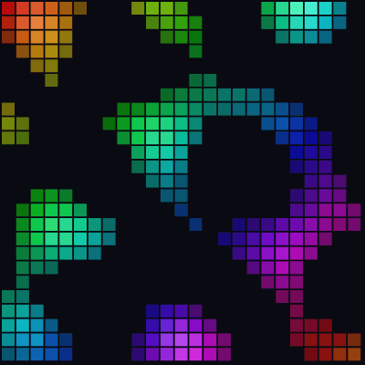

### Kaleidoscope

Eight-fold rotational symmetry with orbiting, pulsing dots.

```clojure
(def frames
  (for [i (range 60)]
    (let [t (anim/progress i 60)]
      {:image/size [400 400]
       :image/background [:color/rgb 5 5 12]
       :image/nodes
       (vec (for [sym (range 8)
                  shape (range 6)]
              (let [angle (+ (* sym (/ Math/PI 4)) (* t Math/PI 0.25))
                    shape-r (+ 30 (* shape 25))
                    shape-angle (+ angle (* shape 0.8)
                                   (* (Math/sin (+ (* t 4 Math/PI) (* shape 1.2))) 0.3))
                    x (+ 200 (* shape-r (Math/cos shape-angle)))
                    y (+ 200 (* shape-r (Math/sin shape-angle)))
                    hue (mod (+ (* sym 45) (* shape 30) (* t 180)) 360)
                    size (+ 5 (* 8 (/ (+ 1 (Math/sin (+ (* t 3 Math/PI) shape sym))) 2.0)))]
                {:node/type :shape/circle
                 :circle/center [x y]
                 :circle/radius size
                 :node/opacity 0.75
                 :style/fill [:color/hsl hue 0.85 0.55]})))})))

(eido/render frames {:output "kaleidoscope.gif" :fps 24})
```

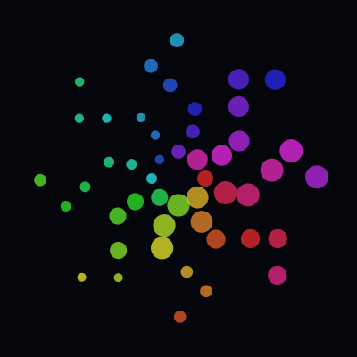

### Blooming Tree

A recursive fractal tree that grows from trunk to full canopy, then sways in the wind. Leaves appear at the tips once fully grown.

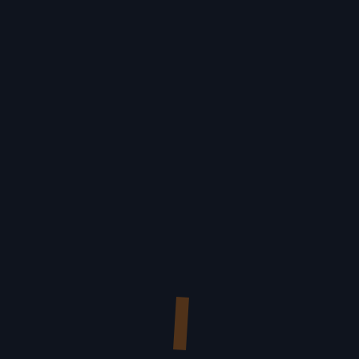

### Sierpinski Triangle

The classic fractal, built up one recursion depth at a time with shifting colors.

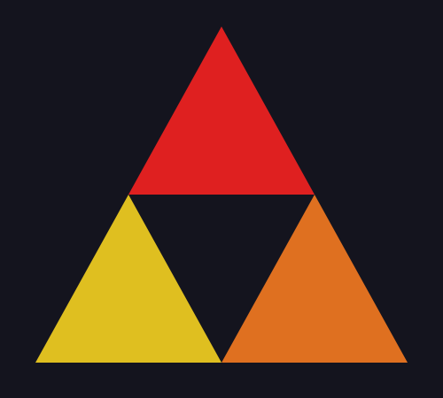

### Koch Snowflake

A Koch snowflake that gains detail with each frame, the boundary growing ever more intricate.


## API

| Function | Description |
|---|---|
| `eido.core/render` | Render scene or animation (opts: :output, :format, :fps, :scale, :dpi, etc.) |
| `eido.core/validate` | Validate scene, returns nil or error vector |
| `eido.core/read-scene` | Read scene from `.edn` file |
| `eido.color/lighten` | Increase lightness of a color vector |
| `eido.color/darken` | Decrease lightness of a color vector |
| `eido.color/saturate` | Increase saturation of a color vector |
| `eido.color/desaturate` | Decrease saturation of a color vector |
| `eido.color/rotate-hue` | Shift hue by degrees |
| `eido.color/lerp` | Interpolate between two color vectors |
| `eido.color/resolve-color` | Color vector to `{:r :g :b :a}` map |
| `eido.color/rgb->hsl` | Convert RGB (0-255) to HSL |
| `eido.scene/grid` | Generate nodes in a grid |
| `eido.scene/distribute` | Distribute nodes along a line |
| `eido.scene/radial` | Distribute nodes around a circle |
| `user/show` | Preview scene in a window (dev) |
| `user/watch-file` | Auto-reload file on save (dev) |
| `user/watch-scene` | Auto-reload atom on change (dev) |
| `user/install-tap!` | Render tapped scenes (dev) |
| `user/play` | Play animation in preview window (dev) |
| `user/stop` | Stop animation playback (dev) |
| `eido.animate/progress` | Normalized frame progress [0, 1] |
| `eido.animate/ping-pong` | Oscillate 0->1->0 |
| `eido.animate/cycle-n` | Multiple cycles within [0, 1] |
| `eido.animate/lerp` | Numeric linear interpolation |
| `eido.animate/ease-in` | Quadratic ease in |
| `eido.animate/ease-out` | Quadratic ease out |
| `eido.animate/ease-in-out` | Quadratic ease in-out |
| `eido.animate/stagger` | Per-element staggered progress |

## Running Tests

```sh
clj -X:test
```

## Status

v0.10.0 — Core language complete. Polish pass: API consistency, expanded tests, full spec documentation.
Headed toward v1.0 alpha.

**This is an experiment and a work in progress. The API is not stable and may change without notice.**
